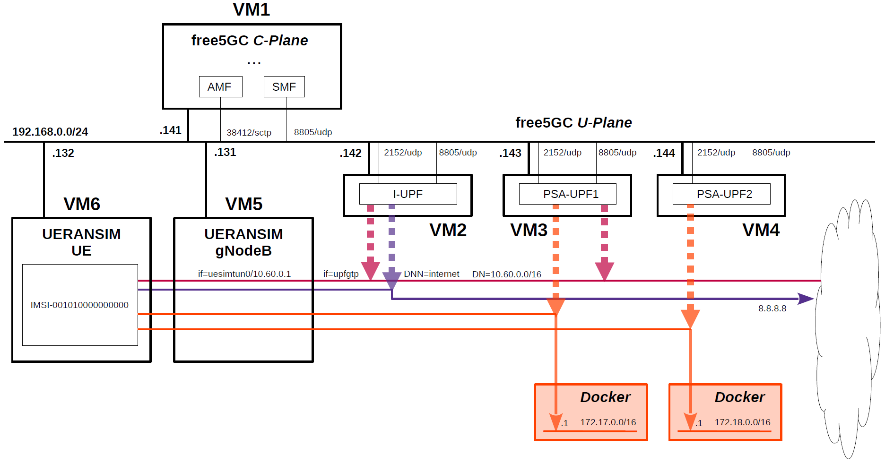

# free5GC 5GC & UERANSIM UE / RAN Sample Configuration - ULCL with one I-UPF and two PSA-UPFs
This describes a very simple configuration that uses free5GC and UERANSIM for ULCL with one I-UPF and two PSA-UPFs.  
**Note. According to [this](https://forum.free5gc.org/t/access-to-local-dn-through-i-upf-in-ulcl-scenario/2512/4), the ULCL feature in free5GC v3.4.0 or later versions won’t work due to the lack of forwarding parameters in FAR creation.**

---

### [Sample Configurations and Miscellaneous for Mobile Network](https://github.com/s5uishida/sample_config_misc_for_mobile_network)

---

<a id="toc"></a>

## Table of Contents

- [Overview of free5GC 5GC Simulation Mobile Network](#overview)
- [Changes in configuration files of free5GC 5GC and UERANSIM UE / RAN](#changes)
  - [Changes in configuration files of free5GC 5GC C-Plane](#changes_cp)
  - [Changes in configuration files of free5GC 5GC U-Plane (I-UPF)](#changes_up1)
  - [Changes in configuration files of free5GC 5GC U-Plane (PSA-UPF1)](#changes_up2)
  - [Changes in configuration files of free5GC 5GC U-Plane (PSA-UPF2)](#changes_up3)
  - [Changes in configuration files of UERANSIM UE / RAN](#changes_ueransim)
    - [Changes in configuration files of RAN (gNodeB)](#changes_ran)
    - [Changes in configuration files of UE](#changes_ue)
- [Network settings of free5GC 5GC and UERANSIM UE / RAN](#network_settings)
  - [Network settings of free5GC 5GC U-Plane (I-UPF)](#network_settings_up1)
  - [Network settings of free5GC 5GC U-Plane (PSA-UPF1)](#network_settings_up2)
  - [Network settings of free5GC 5GC U-Plane (PSA-UPF2)](#network_settings_up3)
- [Build free5GC and UERANSIM](#build)
  - [Build go-upf](#build_upf)
- [Run free5GC 5GC and UERANSIM UE / RAN](#run)
  - [Run free5GC 5GC U-Plane (I-UPF & PSA-UPFs)](#run_up)
  - [Run free5GC 5GC C-Plane](#run_cp)
  - [Run UERANSIM (gNodeB)](#run_ran)
  - [Run UERANSIM (UE)](#run_ue)
    - [Start UE connected to gNodeB](#con_ue)
    - [Ping google.com going through PSA-UPF1](#ping_google)
    - [Ping 8.8.8.8 going through I-UPF](#ping_8)
    - [Ping 172.17.0.1 going through PSA-UPF1](#ping_docker1)
    - [Ping 172.18.0.1 going through PSA-UPF2](#ping_docker2)
- [Changelog (summary)](#changelog)

---
<a id="overview"></a>

## Overview of free5GC 5GC Simulation Mobile Network

The following minimum configuration was set as a condition.
- I-UPF selects the communication paths according to the destination host and network.
- I-UPF connects with multiple PSA-UPFs and each PSA-UPF has the routing information to a specific network.

The built simulation environment is as follows.
**In this configuration, each PSA-UPF must be reachable to Docker network on local.**

</img>

The 5GC / UE / RAN used are as follows.
- 5GC - free5GC v3.4.3 (2024.09.12) - https://github.com/free5gc/free5gc
- UPF - go-upf v1.2.1 (2023.12.19) - https://github.com/free5gc/go-upf
- (UPF) - gtp5g v0.8.10 (2024.06.03) - https://github.com/free5gc/gtp5g
- UE / RAN - UERANSIM v3.2.6 (2024.08.27) - https://github.com/aligungr/UERANSIM

Each VMs are as follows.  
| VM # | SW & Role | IP address | OS | Mem (Min) | HDD (Min) |
| --- | --- | --- | --- | --- | --- |
| VM1 | free5GC  5GC C-Plane | 192.168.0.141/24 | Ubuntu 24.04 | 2GB | 20GB |
| VM2 | free5GC  5GC U-Plane (I-UPF) | 192.168.0.142/24 | Ubuntu 24.04 | 1GB | 10GB |
| VM3 | free5GC  5GC U-Plane (PSA-UPF1) | 192.168.0.143/24 | Ubuntu 24.04 | 1GB | 10GB |
| VM4 | free5GC  5GC U-Plane (PSA-UPF2) | 192.168.0.144/24 | Ubuntu 24.04 | 1GB | 10GB |
| VM5 | UERANSIM RAN (gNodeB) | 192.168.0.131/24 | Ubuntu 24.04 | 1GB | 10GB |
| VM6 | UERANSIM UE | 192.168.0.132/24 | Ubuntu 24.04 | 1GB | 10GB |

Subscriber Information (other information is default) is as follows.  
**Note. Please select OP or OPc according to the setting of UERANSIM UE configuration files.**
| UE | IMSI | DNN | OP/OPc |
| --- | --- | --- | --- |
| UE | 001010000000000 | internet | OPc |

I registered these information with the free5GC WebUI.
In addition, [3GPP TS 35.208](https://www.3gpp.org/DynaReport/35208.htm) "4.3 Test Sets" is published by 3GPP as test data for the 3GPP authentication and key generation functions (MILENAGE).

DN is as follows.
| DN | TUNnel interface of DN | DNN | TUNnel interface of UE |
| --- | --- | --- | --- |
| 10.60.0.0/16 | upfgtp | internet | uesimtun0 |

The UE routing topology is as follows.
```
                    --- PSA-UPF1
                    |
UE --- gNodeB --- I-UPF
                    |
                    --- PSA-UPF2
```
The communication paths to be confirmed for each destination IP address are as follows.
| Destination IP address | Communication path |
| --- | --- |
| google.com | I-UPF --> PSA-UPF1 --> Internet |
| 8.8.8.8 | I-UPF --> Internet |
| 172.17.0.1 | I-UPF --> PSA-UPF1 --> 172.17.0.0/16 (Docker network on local) |
| 172.18.0.1 | I-UPF --> PSA-UPF2 --> 172.18.0.0/16 (Docker network on local) |

<a id="changes"></a>

## Changes in configuration files of free5GC 5GC and UERANSIM UE / RAN

Please refer to the following for building free5GC and UERANSIM respectively.
- free5GC v3.4.3 (2024.09.12) - https://free5gc.org/guide/
- go-upf v1.2.1 (2023.12.19) - https://free5gc.org/guide/
- gtp5g v0.8.10 (2024.06.03) - https://free5gc.org/guide/
- UERANSIM v3.2.6 (2024.08.27) - https://github.com/aligungr/UERANSIM/wiki/Installation

<a id="changes_cp"></a>

### Changes in configuration files of free5GC 5GC C-Plane

- `free5gc/config/amfcfg.yaml`
```diff
--- amfcfg.yaml.orig    2024-08-31 18:40:42.425497926 +0900
+++ amfcfg.yaml 2024-08-31 18:57:16.692270705 +0900
@@ -5,7 +5,7 @@
 configuration:
   amfName: AMF # the name of this AMF
   ngapIpList:  # the IP list of N2 interfaces on this AMF
-    - 127.0.0.18
+    - 192.168.0.141
   ngapPort: 38412 # the SCTP port listened by NGAP
   sbi: # Service-based interface information
     scheme: http # the protocol for sbi (http or https)
@@ -24,18 +24,18 @@
   servedGuamiList: # Guami (Globally Unique AMF ID) list supported by this AMF
     # <GUAMI> = <MCC><MNC><AMF ID>
     - plmnId: # Public Land Mobile Network ID, <PLMN ID> = <MCC><MNC>
-        mcc: 208 # Mobile Country Code (3 digits string, digit: 0~9)
-        mnc: 93 # Mobile Network Code (2 or 3 digits string, digit: 0~9)
+        mcc: 001 # Mobile Country Code (3 digits string, digit: 0~9)
+        mnc: 01 # Mobile Network Code (2 or 3 digits string, digit: 0~9)
       amfId: cafe00 # AMF identifier (3 bytes hex string, range: 000000~FFFFFF)
   supportTaiList:  # the TAI (Tracking Area Identifier) list supported by this AMF
     - plmnId: # Public Land Mobile Network ID, <PLMN ID> = <MCC><MNC>
-        mcc: 208 # Mobile Country Code (3 digits string, digit: 0~9)
-        mnc: 93 # Mobile Network Code (2 or 3 digits string, digit: 0~9)
+        mcc: 001 # Mobile Country Code (3 digits string, digit: 0~9)
+        mnc: 01 # Mobile Network Code (2 or 3 digits string, digit: 0~9)
       tac: 000001 # Tracking Area Code (3 bytes hex string, range: 000000~FFFFFF)
   plmnSupportList: # the PLMNs (Public land mobile network) list supported by this AMF
     - plmnId: # Public Land Mobile Network ID, <PLMN ID> = <MCC><MNC>
-        mcc: 208 # Mobile Country Code (3 digits string, digit: 0~9)
-        mnc: 93 # Mobile Network Code (2 or 3 digits string, digit: 0~9)
+        mcc: 001 # Mobile Country Code (3 digits string, digit: 0~9)
+        mnc: 01 # Mobile Network Code (2 or 3 digits string, digit: 0~9)
       snssaiList: # the S-NSSAI (Single Network Slice Selection Assistance Information) list supported by this AMF
         - sst: 1 # Slice/Service Type (uinteger, range: 0~255)
           sd: 010203 # Slice Differentiator (3 bytes hex string, range: 000000~FFFFFF)
```
- `free5gc/config/ausfcfg.yaml`
```diff
--- ausfcfg.yaml.orig   2024-08-31 18:40:42.425497926 +0900
+++ ausfcfg.yaml        2024-08-31 18:52:04.727832529 +0900
@@ -16,10 +16,8 @@
   nrfUri: http://127.0.0.10:8000 # a valid URI of NRF
   nrfCertPem: cert/nrf.pem # NRF Certificate
   plmnSupportList: # the PLMNs (Public Land Mobile Network) list supported by this AUSF
-    - mcc: 208 # Mobile Country Code (3 digits string, digit: 0~9)
-      mnc: 93  # Mobile Network Code (2 or 3 digits string, digit: 0~9)
-    - mcc: 123 # Mobile Country Code (3 digits string, digit: 0~9)
-      mnc: 45  # Mobile Network Code (2 or 3 digits string, digit: 0~9)
+    - mcc: 001 # Mobile Country Code (3 digits string, digit: 0~9)
+      mnc: 01  # Mobile Network Code (2 or 3 digits string, digit: 0~9)
   groupId: ausfGroup001 # ID for the group of the AUSF
   eapAkaSupiImsiPrefix: false # including "imsi-" prefix or not when using the SUPI to do EAP-AKA' authentication
 
```
- `free5gc/config/nrfcfg.yaml`
```diff
--- nrfcfg.yaml.orig    2024-08-31 18:40:42.425497926 +0900
+++ nrfcfg.yaml 2024-08-31 18:53:00.723935459 +0900
@@ -18,8 +18,8 @@
       key: cert/root.key
     oauth: true
   DefaultPlmnId:
-    mcc: 208 # Mobile Country Code (3 digits string, digit: 0~9)
-    mnc: 93 # Mobile Network Code (2 or 3 digits string, digit: 0~9)
+    mcc: 001 # Mobile Country Code (3 digits string, digit: 0~9)
+    mnc: 01 # Mobile Network Code (2 or 3 digits string, digit: 0~9)
   serviceNameList: # the SBI services provided by this NRF, refer to TS 29.510
     - nnrf-nfm # Nnrf_NFManagement service
     - nnrf-disc # Nnrf_NFDiscovery service
```
- `free5gc/config/nssfcfg.yaml`
```diff
--- nssfcfg.yaml.orig   2024-08-31 18:40:42.425497926 +0900
+++ nssfcfg.yaml        2024-08-31 18:58:49.940161382 +0900
@@ -18,12 +18,12 @@
   nrfUri: http://127.0.0.10:8000 # a valid URI of NRF
   nrfCertPem: cert/nrf.pem # NRF Certificate
   supportedPlmnList: # the PLMNs (Public land mobile network) list supported by this NSSF
-    - mcc: 208 # Mobile Country Code (3 digits string, digit: 0~9)
-      mnc: 93 # Mobile Network Code (2 or 3 digits string, digit: 0~9)
+    - mcc: 001 # Mobile Country Code (3 digits string, digit: 0~9)
+      mnc: 01 # Mobile Network Code (2 or 3 digits string, digit: 0~9)
   supportedNssaiInPlmnList: # Supported S-NSSAI List for each PLMN
     - plmnId: # Public Land Mobile Network ID, <PLMN ID> = <MCC><MNC>
-        mcc: 208 # Mobile Country Code (3 digits string, digit: 0~9)
-        mnc: 93 # Mobile Network Code (2 or 3 digits string, digit: 0~9)
+        mcc: 001 # Mobile Country Code (3 digits string, digit: 0~9)
+        mnc: 01 # Mobile Network Code (2 or 3 digits string, digit: 0~9)
       supportedSnssaiList: # Supported S-NSSAIs of the PLMN
         - sst: 1 # Slice/Service Type (uinteger, range: 0~255)
           sd: 010203 # Slice Differentiator (3 bytes hex string, range: 000000~FFFFFF)
```
- `free5gc/config/smfcfg.yaml`
```diff
--- smfcfg.yaml.orig    2024-09-15 18:09:13.892166385 +0900
+++ smfcfg.yaml 2024-09-15 18:11:35.656659221 +0900
@@ -34,14 +34,14 @@
             ipv4: 8.8.8.8
             ipv6: 2001:4860:4860::8888
   plmnList: # the list of PLMN IDs that this SMF belongs to (optional, remove this key when unnecessary)
-    - mcc: 208 # Mobile Country Code (3 digits string, digit: 0~9)
-      mnc: 93 # Mobile Network Code (2 or 3 digits string, digit: 0~9)
+    - mcc: 001 # Mobile Country Code (3 digits string, digit: 0~9)
+      mnc: 01 # Mobile Network Code (2 or 3 digits string, digit: 0~9)
   locality: area1 # Name of the location where a set of AMF, SMF, PCF and UPFs are located
   pfcp: # the IP address of N4 interface on this SMF (PFCP)
     # addr config is deprecated in smf config v1.0.3, please use the following config
-    nodeID: 127.0.0.1 # the Node ID of this SMF
-    listenAddr: 127.0.0.1 # the IP/FQDN of N4 interface on this SMF (PFCP)
-    externalAddr: 127.0.0.1 # the IP/FQDN of N4 interface on this SMF (PFCP)
+    nodeID: 192.168.0.141 # the Node ID of this SMF
+    listenAddr: 192.168.0.141 # the IP/FQDN of N4 interface on this SMF (PFCP)
+    externalAddr: 192.168.0.141 # the IP/FQDN of N4 interface on this SMF (PFCP)
     assocFailAlertInterval: 10s
     assocFailRetryInterval: 30s
     heartbeatInterval: 10s
@@ -49,10 +49,31 @@
     upNodes: # information of userplane node (AN or UPF)
       gNB1: # the name of the node
         type: AN # the type of the node (AN or UPF)
-      UPF: # the name of the node
+      I-UPF: # the name of the node
         type: UPF # the type of the node (AN or UPF)
-        nodeID: 127.0.0.8 # the Node ID of this UPF
-        addr: 127.0.0.8 # the IP/FQDN of N4 interface on this UPF (PFCP)
+        nodeID: 192.168.0.142 # the Node ID of this UPF
+        addr: 192.168.0.142 # the IP/FQDN of N4 interface on this UPF (PFCP)
+        sNssaiUpfInfos: # S-NSSAI information list for this UPF
+          - sNssai: # S-NSSAI (Single Network Slice Selection Assistance Information)
+              sst: 1 # Slice/Service Type (uinteger, range: 0~255)
+              sd: 010203 # Slice Differentiator (3 bytes hex string, range: 000000~FFFFFF)
+            dnnUpfInfoList: # DNN information list for this S-NSSAI
+              - dnn: internet
+        interfaces: # Interface list for this UPF
+          - interfaceType: N3 # the type of the interface (N3 or N9)
+            endpoints: # the IP address of this N3/N9 interface on this UPF
+              - 192.168.0.142
+            networkInstances: # Data Network Name (DNN)
+              - internet
+          - interfaceType: N9 # the type of the interface (N3 or N9)
+            endpoints: # the IP address of this N3/N9 interface on this UPF
+              - 192.168.0.142
+            networkInstances: # Data Network Name (DNN)
+              - internet
+      PSA-UPF1: # the name of the node
+        type: UPF # the type of the node (AN or UPF)
+        nodeID: 192.168.0.143 # the Node ID of this UPF
+        addr: 192.168.0.143 # the IP/FQDN of N4 interface on this UPF (PFCP)
         sNssaiUpfInfos: # S-NSSAI information list for this UPF
           - sNssai: # S-NSSAI (Single Network Slice Selection Assistance Information)
               sst: 1 # Slice/Service Type (uinteger, range: 0~255)
@@ -63,24 +84,36 @@
                   - cidr: 10.60.0.0/16
                 staticPools:
                   - cidr: 10.60.100.0/24
+        interfaces: # Interface list for this UPF
+          - interfaceType: N9 # the type of the interface (N3 or N9)
+            endpoints: # the IP address of this N3/N9 interface on this UPF
+              - 192.168.0.143
+            networkInstances: # Data Network Name (DNN)
+              - internet
+      PSA-UPF2: # the name of the node
+        type: UPF # the type of the node (AN or UPF)
+        nodeID: 192.168.0.144 # the Node ID of this UPF
+        addr: 192.168.0.144 # the IP/FQDN of N4 interface on this UPF (PFCP)
+        sNssaiUpfInfos: # S-NSSAI information list for this UPF
           - sNssai: # S-NSSAI (Single Network Slice Selection Assistance Information)
               sst: 1 # Slice/Service Type (uinteger, range: 0~255)
-              sd: 112233 # Slice Differentiator (3 bytes hex string, range: 000000~FFFFFF)
+              sd: 010203 # Slice Differentiator (3 bytes hex string, range: 000000~FFFFFF)
             dnnUpfInfoList: # DNN information list for this S-NSSAI
               - dnn: internet
-                pools:
-                  - cidr: 10.61.0.0/16
-                staticPools:
-                  - cidr: 10.61.100.0/24
         interfaces: # Interface list for this UPF
-          - interfaceType: N3 # the type of the interface (N3 or N9)
+          - interfaceType: N9 # the type of the interface (N3 or N9)
             endpoints: # the IP address of this N3/N9 interface on this UPF
-              - 127.0.0.8
+              - 192.168.0.144
             networkInstances: # Data Network Name (DNN)
               - internet
     links: # the topology graph of userplane, A and B represent the two nodes of each link
       - A: gNB1
-        B: UPF
+        B: I-UPF
+      - A: I-UPF
+        B: PSA-UPF1
+      - A: I-UPF
+        B: PSA-UPF2
+  ulcl: true
   # retransmission timer for pdu session modification command
   t3591:
     enable: true # true or false
```
- `free5gc/config/uerouting.yaml`
```yaml
info:
  version: 1.0.7
  description: Routing information for UE

ueRoutingInfo: # the list of UE routing information
  UE1: # Group Name
    members:
    - imsi-001010000000000 # Subscription Permanent Identifier of the UE
    topology: # Network topology for this group (Uplink: A->B, Downlink: B->A)
    # default path derived from this topology
    # node name should be consistent with smfcfg.yaml
      - A: gNB1
        B: I-UPF
      - A: I-UPF
        B: PSA-UPF1
    specificPath:
      - dest: 172.17.0.0/16 # the destination IP address on Data Network (DN)
        # the order of UPF nodes in this path. We use the UPF's name to represent each UPF node.
        # The UPF's name should be consistent with smfcfg.yaml
        path: [I-UPF, PSA-UPF1]
      - dest: 172.18.0.0/16
        path: [I-UPF, PSA-UPF2]
      - dest: 8.8.8.8/32
        path: [I-UPF]
```

<a id="changes_up1"></a>

### Changes in configuration files of free5GC 5GC U-Plane (I-UPF)

- `go-upf/upfcfg.yaml`
```diff
--- upfcfg.yaml.orig    2024-08-31 19:23:52.419250932 +0900
+++ upfcfg.yaml 2024-09-15 18:28:12.128539749 +0900
@@ -3,8 +3,8 @@
 
 # The listen IP and nodeID of the N4 interface on this UPF (Can't set to 0.0.0.0)
 pfcp:
-  addr: 127.0.0.8   # IP addr for listening
-  nodeID: 127.0.0.8 # External IP or FQDN can be reached
+  addr: 192.168.0.142   # IP addr for listening
+  nodeID: 192.168.0.142 # External IP or FQDN can be reached
   retransTimeout: 1s # retransmission timeout
   maxRetrans: 3 # the max number of retransmission
 
@@ -13,18 +13,18 @@
   # The IP list of the N3/N9 interfaces on this UPF
   # If there are multiple connection, set addr to 0.0.0.0 or list all the addresses
   ifList:
-    - addr: 127.0.0.8
+    - addr: 192.168.0.142
       type: N3
       # name: upf.5gc.nctu.me
       # ifname: gtpif
       # mtu: 1400
+    - addr: 192.168.0.142
+      type: N9
 
 # The DNN list supported by UPF
 dnnList:
   - dnn: internet # Data Network Name
     cidr: 10.60.0.0/16 # Classless Inter-Domain Routing for assigned IPv4 pool of UE
-  - dnn: internet # Data Network Name
-    cidr: 10.61.0.0/16 # Classless Inter-Domain Routing for assigned IPv4 pool of UE
     # natifname: eth0
 
 logger: # log output setting
```

<a id="changes_up2"></a>

### Changes in configuration files of free5GC 5GC U-Plane (PSA-UPF1)

- `go-upf/upfcfg.yaml`
```diff
--- upfcfg.yaml.orig    2024-08-31 19:23:52.419250932 +0900
+++ upfcfg.yaml 2024-09-15 18:32:10.552002281 +0900
@@ -3,8 +3,8 @@
 
 # The listen IP and nodeID of the N4 interface on this UPF (Can't set to 0.0.0.0)
 pfcp:
-  addr: 127.0.0.8   # IP addr for listening
-  nodeID: 127.0.0.8 # External IP or FQDN can be reached
+  addr: 192.168.0.143   # IP addr for listening
+  nodeID: 192.168.0.143 # External IP or FQDN can be reached
   retransTimeout: 1s # retransmission timeout
   maxRetrans: 3 # the max number of retransmission
 
@@ -13,8 +13,8 @@
   # The IP list of the N3/N9 interfaces on this UPF
   # If there are multiple connection, set addr to 0.0.0.0 or list all the addresses
   ifList:
-    - addr: 127.0.0.8
-      type: N3
+    - addr: 192.168.0.143
+      type: N9
       # name: upf.5gc.nctu.me
       # ifname: gtpif
       # mtu: 1400
@@ -23,8 +23,6 @@
 dnnList:
   - dnn: internet # Data Network Name
     cidr: 10.60.0.0/16 # Classless Inter-Domain Routing for assigned IPv4 pool of UE
-  - dnn: internet # Data Network Name
-    cidr: 10.61.0.0/16 # Classless Inter-Domain Routing for assigned IPv4 pool of UE
     # natifname: eth0
 
 logger: # log output setting
```

<a id="changes_up3"></a>

### Changes in configuration files of free5GC 5GC U-Plane (PSA-UPF2)

- `go-upf/upfcfg.yaml`
```diff
--- upfcfg.yaml.orig    2024-08-31 19:23:52.419250932 +0900
+++ upfcfg.yaml 2024-09-15 18:35:11.789220274 +0900
@@ -3,8 +3,8 @@
 
 # The listen IP and nodeID of the N4 interface on this UPF (Can't set to 0.0.0.0)
 pfcp:
-  addr: 127.0.0.8   # IP addr for listening
-  nodeID: 127.0.0.8 # External IP or FQDN can be reached
+  addr: 192.168.0.144   # IP addr for listening
+  nodeID: 192.168.0.144 # External IP or FQDN can be reached
   retransTimeout: 1s # retransmission timeout
   maxRetrans: 3 # the max number of retransmission
 
@@ -13,8 +13,8 @@
   # The IP list of the N3/N9 interfaces on this UPF
   # If there are multiple connection, set addr to 0.0.0.0 or list all the addresses
   ifList:
-    - addr: 127.0.0.8
-      type: N3
+    - addr: 192.168.0.144
+      type: N9
       # name: upf.5gc.nctu.me
       # ifname: gtpif
       # mtu: 1400
@@ -23,8 +23,6 @@
 dnnList:
   - dnn: internet # Data Network Name
     cidr: 10.60.0.0/16 # Classless Inter-Domain Routing for assigned IPv4 pool of UE
-  - dnn: internet # Data Network Name
-    cidr: 10.61.0.0/16 # Classless Inter-Domain Routing for assigned IPv4 pool of UE
     # natifname: eth0
 
 logger: # log output setting
```

<a id="changes_ueransim"></a>

### Changes in configuration files of UERANSIM UE / RAN

<a id="changes_ran"></a>

#### Changes in configuration files of RAN (gNodeB)

- `UERANSIM/config/free5gc-gnb.yaml`
```diff
--- free5gc-gnb.yaml.orig       2024-05-12 01:59:00.000000000 +0900
+++ free5gc-gnb.yaml    2024-09-15 18:42:02.193131540 +0900
@@ -1,17 +1,17 @@
-mcc: '208'          # Mobile Country Code value
-mnc: '93'           # Mobile Network Code value (2 or 3 digits)
+mcc: '001'          # Mobile Country Code value
+mnc: '01'           # Mobile Network Code value (2 or 3 digits)
 
 nci: '0x000000010'  # NR Cell Identity (36-bit)
 idLength: 32        # NR gNB ID length in bits [22...32]
 tac: 1              # Tracking Area Code
 
-linkIp: 127.0.0.1   # gNB's local IP address for Radio Link Simulation (Usually same with local IP)
-ngapIp: 127.0.0.1   # gNB's local IP address for N2 Interface (Usually same with local IP)
-gtpIp: 127.0.0.1    # gNB's local IP address for N3 Interface (Usually same with local IP)
+linkIp: 192.168.0.131   # gNB's local IP address for Radio Link Simulation (Usually same with local IP)
+ngapIp: 192.168.0.131   # gNB's local IP address for N2 Interface (Usually same with local IP)
+gtpIp: 192.168.0.131    # gNB's local IP address for N3 Interface (Usually same with local IP)
 
 # List of AMF address information
 amfConfigs:
-  - address: 127.0.0.1
+  - address: 192.168.0.141
     port: 38412
 
 # List of supported S-NSSAIs by this gNB
```

<a id="changes_ue"></a>

#### Changes in configuration files of UE

- `UERANSIM/config/free5gc-ue.yaml`
```diff
--- free5gc-ue.yaml.orig        2024-05-12 01:59:00.000000000 +0900
+++ free5gc-ue.yaml     2024-08-31 20:59:23.069355772 +0900
@@ -1,9 +1,9 @@
 # IMSI number of the UE. IMSI = [MCC|MNC|MSISDN] (In total 15 digits)
-supi: 'imsi-208930000000001'
+supi: 'imsi-001010000000000'
 # Mobile Country Code value of HPLMN
-mcc: '208'
+mcc: '001'
 # Mobile Network Code value of HPLMN (2 or 3 digits)
-mnc: '93'
+mnc: '01'
 # SUCI Protection Scheme : 0 for Null-scheme, 1 for Profile A and 2 for Profile B
 protectionScheme: 0
 # Home Network Public Key for protecting with SUCI Profile A
@@ -28,7 +28,7 @@
 
 # List of gNB IP addresses for Radio Link Simulation
 gnbSearchList:
-  - 127.0.0.1
+  - 192.168.0.131
 
 # UAC Access Identities Configuration
 uacAic:
```

<a id="network_settings"></a>

## Network settings of free5GC 5GC and UERANSIM UE / RAN

<a id="network_settings_up1"></a>

### Network settings of free5GC 5GC U-Plane (I-UPF)

First, uncomment the next line in the `/etc/sysctl.conf` file and reflect it in the OS.
```
net.ipv4.ip_forward=1
```
```
# sysctl -p
```
Next, configure NAPT.
```
# iptables -t nat -A POSTROUTING -s 10.60.0.0/16 ! -o upfgtp -j MASQUERADE
```

<a id="network_settings_up2"></a>

### Network settings of free5GC 5GC U-Plane (PSA-UPF1)

First, uncomment the next line in the `/etc/sysctl.conf` file and reflect it in the OS.
```
net.ipv4.ip_forward=1
```
```
# sysctl -p
```
Next, configure NAPT.
```
# iptables -t nat -A POSTROUTING -s 10.60.0.0/16 ! -o upfgtp -j MASQUERADE
```

<a id="network_settings_up3"></a>

### Network settings of free5GC 5GC U-Plane (PSA-UPF2)

First, uncomment the next line in the `/etc/sysctl.conf` file and reflect it in the OS.
```
net.ipv4.ip_forward=1
```
```
# sysctl -p
```
Next, configure NAPT.
```
# iptables -t nat -A POSTROUTING -s 10.60.0.0/16 ! -o upfgtp -j MASQUERADE
```

<a id="build"></a>

## Build free5GC and UERANSIM

Please refer to the following for building free5GC and UERANSIM respectively.
- free5GC v3.4.3 (2024.09.12) - https://free5gc.org/guide/
- go-upf v1.2.1 (2023.12.19) - https://free5gc.org/guide/
- gtp5g v0.8.10 (2024.06.03) - https://free5gc.org/guide/
- UERANSIM v3.2.6 (2024.08.27) - https://github.com/aligungr/UERANSIM/wiki/Installation

Install MongoDB on free5GC 5GC C-Plane machine.
It is not necessary to install MongoDB on free5GC 5GC U-Plane machines.
[MongoDB Compass](https://www.mongodb.com/products/compass) is a convenient tool to look at the MongoDB database.

**Note. The installation guide also includes instructions on building the latest committed version.**

<a id="build_upf"></a>

### Build go-upf

For UPF, select the go-upf version that enables ULCL with the free5GC version selected this time.
Please refer to the free5GC guide at the above URL for building free5GC UPF. Below show only the differences in the procedure.
```
# git clone -b v1.2.1 https://github.com/free5gc/go-upf.git
# cd go-upf
# CGO_ENABLED=0 go build -o upf cmd/main.go
# ls upf
upf
# wget https://raw.githubusercontent.com/free5gc/free5gc/main/config/upfcfg.yaml
```

<a id="run"></a>

## Run free5GC 5GC and UERANSIM UE / RAN

First run the 5GC, then UERANSIM (UE & RAN implementation).

<a id="run_up"></a>

### Run free5GC 5GC U-Plane (I-UPF & PSA-UPFs)

- free5GC 5GC U-Plane (I-UPF)
```
# cd go-upf
# ./upf -c upfcfg.yaml
```
- free5GC 5GC U-Plane (PSA-UPF1)
```
# cd go-upf
# ./upf -c upfcfg.yaml
```
- free5GC 5GC U-Plane (PSA-UPF2)
```
# cd go-upf
# ./upf -c upfcfg.yaml
```
Then run `tcpdump` on one more terminals for U-Plane.
- Run `tcpdump` on VM2 (U-Plane (I-UPF))
```
# tcpdump -i upfgtp -n
tcpdump: verbose output suppressed, use -v[v]... for full protocol decode
listening on upfgtp, link-type RAW (Raw IP), snapshot length 262144 bytes
```
- Run `tcpdump` on VM3 (U-Plane (PSA-UPF1))
```
# tcpdump -i upfgtp -n
tcpdump: verbose output suppressed, use -v[v]... for full protocol decode
listening on upfgtp, link-type RAW (Raw IP), snapshot length 262144 bytes
```
- Run `tcpdump` on VM4 (U-Plane (PSA-UPF2))
```
# tcpdump -i upfgtp -n
tcpdump: verbose output suppressed, use -v[v]... for full protocol decode
listening on upfgtp, link-type RAW (Raw IP), snapshot length 262144 bytes
```

<a id="run_cp"></a>

### Run free5GC 5GC C-Plane

Next, run free5GC 5GC C-Plane.

- free5GC 5GC C-Plane

Create the following shell script and run it.
```bash
#!/usr/bin/env bash

PID_LIST=()

NF_LIST="amf udr pcf udm nssf ausf chf"

export GIN_MODE=release

./bin/nrf &
PID_LIST+=($!)
sleep 1

./bin/smf -c config/smfcfg.yaml -u config/uerouting.yaml &
PID_LIST+=($!)
sleep 1

for NF in ${NF_LIST}; do
    ./bin/${NF} &
    PID_LIST+=($!)
    sleep 1
done

function terminate()
{
    sudo kill -SIGTERM ${PID_LIST[${#PID_LIST[@]}-2]} ${PID_LIST[${#PID_LIST[@]}-1]}
    sleep 2
}

trap terminate SIGINT
wait ${PID_LIST}
```

<a id="run_ran"></a>

### Run UERANSIM (gNodeB)

Please refer to the following for usage of UERANSIM.

https://github.com/aligungr/UERANSIM/wiki/Usage

```
# ./nr-gnb -c ../config/free5gc-gnb.yaml
UERANSIM v3.2.6
[2024-09-15 21:33:03.411] [sctp] [info] Trying to establish SCTP connection... (192.168.0.141:38412)
[2024-09-15 21:33:03.424] [sctp] [info] SCTP connection established (192.168.0.141:38412)
[2024-09-15 21:33:03.425] [sctp] [debug] SCTP association setup ascId[7]
[2024-09-15 21:33:03.426] [ngap] [debug] Sending NG Setup Request
[2024-09-15 21:33:03.438] [ngap] [debug] NG Setup Response received
[2024-09-15 21:33:03.438] [ngap] [info] NG Setup procedure is successful
```
The free5GC C-Plane log when executed is as follows.
```
2024-09-15T21:33:03.436262074+09:00 [INFO][AMF][Ngap] [AMF] SCTP Accept from: 192.168.0.131:53265
2024-09-15T21:33:03.439084938+09:00 [INFO][AMF][Ngap] Create a new NG connection for: 192.168.0.131:53265
2024-09-15T21:33:03.442868183+09:00 [INFO][AMF][Ngap][ran_addr:192.168.0.131:53265] Handle NGSetupRequest
2024-09-15T21:33:03.445385889+09:00 [INFO][AMF][Ngap][ran_addr:192.168.0.131:53265] Send NG-Setup response
```

<a id="run_ue"></a>

### Run UERANSIM (UE)

Ping the following four destination IP addresses and confirm that they are routed through different UPFs.

- google.com - routing from PSA-UPF1 to Internet
- 8.8.8.8 - routing from I-UPF to Internet
- 172.17.0.1 - routing from PSA-UPF1 to 172.17.0.0/16 (Docker network on local)
- 172.18.0.1 - routing from PSA-UPF2 to 172.18.0.0/16 (Docker network on local)

**Note. For example, 172.17.0.0/16 is docker's default network.**

<a id="con_ue"></a>

#### Start UE connected to gNodeB

```
# ./nr-ue -c ../config/free5gc-ue.yaml
UERANSIM v3.2.6
[2024-09-15 21:34:31.407] [nas] [info] UE switches to state [MM-DEREGISTERED/PLMN-SEARCH]
[2024-09-15 21:34:31.409] [rrc] [debug] New signal detected for cell[1], total [1] cells in coverage
[2024-09-15 21:34:31.411] [nas] [info] Selected plmn[001/01]
[2024-09-15 21:34:31.412] [rrc] [info] Selected cell plmn[001/01] tac[1] category[SUITABLE]
[2024-09-15 21:34:31.413] [nas] [info] UE switches to state [MM-DEREGISTERED/PS]
[2024-09-15 21:34:31.414] [nas] [info] UE switches to state [MM-DEREGISTERED/NORMAL-SERVICE]
[2024-09-15 21:34:31.414] [nas] [debug] Initial registration required due to [MM-DEREG-NORMAL-SERVICE]
[2024-09-15 21:34:31.414] [nas] [debug] UAC access attempt is allowed for identity[0], category[MO_sig]
[2024-09-15 21:34:31.414] [nas] [debug] Sending Initial Registration
[2024-09-15 21:34:31.414] [nas] [info] UE switches to state [MM-REGISTER-INITIATED]
[2024-09-15 21:34:31.414] [rrc] [debug] Sending RRC Setup Request
[2024-09-15 21:34:31.416] [rrc] [info] RRC connection established
[2024-09-15 21:34:31.417] [rrc] [info] UE switches to state [RRC-CONNECTED]
[2024-09-15 21:34:31.417] [nas] [info] UE switches to state [CM-CONNECTED]
[2024-09-15 21:34:31.541] [nas] [debug] Authentication Request received
[2024-09-15 21:34:31.541] [nas] [debug] Received SQN [00000000003D]
[2024-09-15 21:34:31.541] [nas] [debug] SQN-MS [000000000000]
[2024-09-15 21:34:31.566] [nas] [debug] Security Mode Command received
[2024-09-15 21:34:31.566] [nas] [debug] Selected integrity[2] ciphering[0]
[2024-09-15 21:34:31.723] [nas] [debug] Registration accept received
[2024-09-15 21:34:31.723] [nas] [info] UE switches to state [MM-REGISTERED/NORMAL-SERVICE]
[2024-09-15 21:34:31.723] [nas] [debug] Sending Registration Complete
[2024-09-15 21:34:31.724] [nas] [info] Initial Registration is successful
[2024-09-15 21:34:31.724] [nas] [debug] Sending PDU Session Establishment Request
[2024-09-15 21:34:31.726] [nas] [debug] UAC access attempt is allowed for identity[0], category[MO_sig]
[2024-09-15 21:34:31.929] [nas] [debug] Configuration Update Command received
[2024-09-15 21:34:32.078] [nas] [debug] PDU Session Establishment Accept received
[2024-09-15 21:34:32.078] [nas] [info] PDU Session establishment is successful PSI[1]
[2024-09-15 21:34:32.099] [app] [info] Connection setup for PDU session[1] is successful, TUN interface[uesimtun0, 10.60.0.1] is up.
```
The free5GC C-Plane log when executed is as follows.
```
2024-09-15T21:34:31.427401493+09:00 [INFO][AMF][Ngap][ran_addr:192.168.0.131:53265] Handle InitialUEMessage
2024-09-15T21:34:31.427512166+09:00 [INFO][AMF][Ngap][amf_ue_ngap_id:RU:1,AU:1(3GPP)][ran_addr:192.168.0.131:53265] New RanUe [RanUeNgapID:1][AmfUeNgapID:1]
2024-09-15T21:34:31.428429965+09:00 [INFO][AMF][Ngap][ran_addr:192.168.0.131:53265] 5GSMobileIdentity ["SUCI":"suci-0-001-01-0000-0-0-0000000000", err: <nil>]
2024-09-15T21:34:31.432555731+09:00 [INFO][AMF][CTX] New AmfUe [supi:][guti:00101cafe0000000001]
2024-09-15T21:34:31.433922826+09:00 [INFO][AMF][Gmm] Handle event[Gmm Message], transition from [Deregistered] to [Deregistered]
2024-09-15T21:34:31.434053341+09:00 [INFO][AMF][Gmm][amf_ue_ngap_id:RU:1,AU:1(3GPP)][supi:SUPI:] Handle Registration Request
2024-09-15T21:34:31.434858233+09:00 [INFO][AMF][Gmm][amf_ue_ngap_id:RU:1,AU:1(3GPP)][supi:SUPI:] RegistrationType: Initial Registration
2024-09-15T21:34:31.434928681+09:00 [INFO][AMF][Gmm][amf_ue_ngap_id:RU:1,AU:1(3GPP)][supi:SUPI:] MobileIdentity5GS: SUCI[suci-0-001-01-0000-0-0-0000000000]
2024-09-15T21:34:31.435069401+09:00 [INFO][AMF][Gmm] Handle event[Start Authentication], transition from [Deregistered] to [Authentication]
2024-09-15T21:34:31.435111141+09:00 [INFO][AMF][Gmm][amf_ue_ngap_id:RU:1,AU:1(3GPP)][supi:SUPI:] Authentication procedure
2024-09-15T21:34:31.437957697+09:00 [INFO][NRF][Token] In HTTPAccessTokenRequest
2024-09-15T21:34:31.444299606+09:00 [WARN][NRF][Token] Certificate verify: x509: certificate signed by unknown authority (possibly because of "x509: invalid signature: parent certificate cannot sign this kind of certificate" while trying to verify candidate authority certificate "free5gc")
2024-09-15T21:34:31.455598947+09:00 [INFO][NRF][GIN] | 200 |       127.0.0.1 | POST    | /oauth2/token |
2024-09-15T21:34:31.459804007+09:00 [INFO][NRF][DISC] Handle NFDiscoveryRequest
2024-09-15T21:34:31.463715420+09:00 [INFO][NRF][GIN] | 200 |       127.0.0.1 | GET     | /nnrf-disc/v1/nf-instances?requester-nf-type=AMF&target-nf-type=AUSF |
2024-09-15T21:34:31.472403550+09:00 [INFO][NRF][Token] In HTTPAccessTokenRequest
2024-09-15T21:34:31.479455122+09:00 [WARN][NRF][Token] Certificate verify: x509: certificate signed by unknown authority (possibly because of "x509: invalid signature: parent certificate cannot sign this kind of certificate" while trying to verify candidate authority certificate "free5gc")
2024-09-15T21:34:31.487974613+09:00 [INFO][NRF][GIN] | 200 |       127.0.0.1 | POST    | /oauth2/token |
2024-09-15T21:34:31.492195137+09:00 [INFO][AUSF][UeAuth] HandleUeAuthPostRequest
2024-09-15T21:34:31.492757925+09:00 [INFO][AUSF][UeAuth] Serving network authorized
2024-09-15T21:34:31.494079065+09:00 [INFO][NRF][Token] In HTTPAccessTokenRequest
2024-09-15T21:34:31.496169962+09:00 [WARN][NRF][Token] Certificate verify: x509: certificate signed by unknown authority (possibly because of "x509: invalid signature: parent certificate cannot sign this kind of certificate" while trying to verify candidate authority certificate "free5gc")
2024-09-15T21:34:31.501092227+09:00 [INFO][NRF][GIN] | 200 |       127.0.0.1 | POST    | /oauth2/token |
2024-09-15T21:34:31.502556009+09:00 [INFO][NRF][DISC] Handle NFDiscoveryRequest
2024-09-15T21:34:31.504571578+09:00 [INFO][NRF][GIN] | 200 |       127.0.0.1 | GET     | /nnrf-disc/v1/nf-instances?requester-nf-type=AUSF&service-names=nudm-ueau&target-nf-type=UDM |
2024-09-15T21:34:31.505723142+09:00 [INFO][NRF][Token] In HTTPAccessTokenRequest
2024-09-15T21:34:31.506903697+09:00 [WARN][NRF][Token] Certificate verify: x509: certificate signed by unknown authority (possibly because of "x509: invalid signature: parent certificate cannot sign this kind of certificate" while trying to verify candidate authority certificate "free5gc")
2024-09-15T21:34:31.512429013+09:00 [INFO][NRF][GIN] | 200 |       127.0.0.1 | POST    | /oauth2/token |
2024-09-15T21:34:31.514708199+09:00 [INFO][UDM][UEAU] Handle GenerateAuthDataRequest
2024-09-15T21:34:31.516004662+09:00 [INFO][NRF][Token] In HTTPAccessTokenRequest
2024-09-15T21:34:31.518543207+09:00 [WARN][NRF][Token] Certificate verify: x509: certificate signed by unknown authority (possibly because of "x509: invalid signature: parent certificate cannot sign this kind of certificate" while trying to verify candidate authority certificate "free5gc")
2024-09-15T21:34:31.523959935+09:00 [INFO][NRF][GIN] | 200 |       127.0.0.1 | POST    | /oauth2/token |
2024-09-15T21:34:31.525839390+09:00 [INFO][UDM][Suci] suciPart: [suci 0 001 01 0000 0 0 0000000000]
2024-09-15T21:34:31.526106474+09:00 [INFO][UDM][Suci] scheme 0
2024-09-15T21:34:31.526145539+09:00 [INFO][UDM][Suci] SUPI type is IMSI
http://127.0.0.10:8000
2024-09-15T21:34:31.526688676+09:00 [INFO][NRF][Token] In HTTPAccessTokenRequest
2024-09-15T21:34:31.528429497+09:00 [WARN][NRF][Token] Certificate verify: x509: certificate signed by unknown authority (possibly because of "x509: invalid signature: parent certificate cannot sign this kind of certificate" while trying to verify candidate authority certificate "free5gc")
2024-09-15T21:34:31.531792164+09:00 [INFO][NRF][GIN] | 200 |       127.0.0.1 | POST    | /oauth2/token |
2024-09-15T21:34:31.533286089+09:00 [INFO][NRF][DISC] Handle NFDiscoveryRequest
2024-09-15T21:34:31.534515287+09:00 [INFO][NRF][GIN] | 200 |       127.0.0.1 | GET     | /nnrf-disc/v1/nf-instances?requester-nf-type=UDM&target-nf-type=UDR |
2024-09-15T21:34:31.537441618+09:00 [INFO][UDR][GIN] | 200 |       127.0.0.1 | GET     | /nudr-dr/v1/subscription-data/imsi-001010000000000/authentication-data/authentication-subscription |
2024-09-15T21:34:31.538674783+09:00 [INFO][UDM][UEAU] Nil Op
2024-09-15T21:34:31.543674304+09:00 [INFO][UDR][GIN] | 204 |       127.0.0.1 | PATCH   | /nudr-dr/v1/subscription-data/imsi-001010000000000/authentication-data/authentication-subscription |
2024-09-15T21:34:31.544296800+09:00 [INFO][UDM][GIN] | 200 |       127.0.0.1 | POST    | /nudm-ueau/v1/suci-0-001-01-0000-0-0-0000000000/security-information/generate-auth-data |
2024-09-15T21:34:31.544890442+09:00 [INFO][AUSF][UeAuth] Add SuciSupiPair (suci-0-001-01-0000-0-0-0000000000, imsi-001010000000000) to map.
2024-09-15T21:34:31.545305882+09:00 [INFO][AUSF][UeAuth] Use 5G AKA auth method
2024-09-15T21:34:31.545649335+09:00 [INFO][AUSF][5gAka] XresStar = 6332616338616132386231383830636235326632666437623238633638613961
2024-09-15T21:34:31.546109132+09:00 [INFO][AUSF][GIN] | 201 |       127.0.0.1 | POST    | /nausf-auth/v1/ue-authentications |
2024-09-15T21:34:31.546654236+09:00 [INFO][AMF][Gmm][amf_ue_ngap_id:RU:1,AU:1(3GPP)][supi:SUPI:] Send Authentication Request
2024-09-15T21:34:31.547012895+09:00 [INFO][AMF][Ngap][amf_ue_ngap_id:RU:1,AU:1(3GPP)][ran_addr:192.168.0.131:53265] Send Downlink Nas Transport
2024-09-15T21:34:31.547759369+09:00 [INFO][AMF][Gmm][amf_ue_ngap_id:RU:1,AU:1(3GPP)][supi:SUPI:] Start T3560 timer
2024-09-15T21:34:31.549374286+09:00 [INFO][AMF][Ngap][ran_addr:192.168.0.131:53265] Handle UplinkNASTransport
2024-09-15T21:34:31.549397033+09:00 [INFO][AMF][Ngap][amf_ue_ngap_id:RU:1,AU:1(3GPP)][ran_addr:192.168.0.131:53265] Handle UplinkNASTransport (RAN UE NGAP ID: 1)
2024-09-15T21:34:31.549434014+09:00 [INFO][AMF][Gmm] Handle event[Gmm Message], transition from [Authentication] to [Authentication]
2024-09-15T21:34:31.549440666+09:00 [INFO][AMF][Gmm][amf_ue_ngap_id:RU:1,AU:1(3GPP)][supi:SUPI:] Handle Authentication Response
2024-09-15T21:34:31.549447324+09:00 [INFO][AMF][Gmm][amf_ue_ngap_id:RU:1,AU:1(3GPP)][supi:SUPI:] Stop T3560 timer
2024-09-15T21:34:31.550268339+09:00 [INFO][NRF][Token] In HTTPAccessTokenRequest
2024-09-15T21:34:31.551827501+09:00 [WARN][NRF][Token] Certificate verify: x509: certificate signed by unknown authority (possibly because of "x509: invalid signature: parent certificate cannot sign this kind of certificate" while trying to verify candidate authority certificate "free5gc")
2024-09-15T21:34:31.554964569+09:00 [INFO][NRF][GIN] | 200 |       127.0.0.1 | POST    | /oauth2/token |
2024-09-15T21:34:31.556250123+09:00 [INFO][AUSF][5gAka] Auth5gAkaComfirmRequest
2024-09-15T21:34:31.556667794+09:00 [INFO][AUSF][5gAka] res*: 6332616338616132386231383830636235326632666437623238633638613961
Xres*: 6332616338616132386231383830636235326632666437623238633638613961
2024-09-15T21:34:31.556757540+09:00 [INFO][AUSF][5gAka] 5G AKA confirmation succeeded
2024-09-15T21:34:31.557654548+09:00 [INFO][NRF][Token] In HTTPAccessTokenRequest
2024-09-15T21:34:31.558828887+09:00 [WARN][NRF][Token] Certificate verify: x509: certificate signed by unknown authority (possibly because of "x509: invalid signature: parent certificate cannot sign this kind of certificate" while trying to verify candidate authority certificate "free5gc")
2024-09-15T21:34:31.562316466+09:00 [INFO][NRF][GIN] | 200 |       127.0.0.1 | POST    | /oauth2/token |
2024-09-15T21:34:31.563561762+09:00 [INFO][UDM][UEAU] Handle ConfirmAuthDataRequest
2024-09-15T21:34:31.564428869+09:00 [INFO][NRF][Token] In HTTPAccessTokenRequest
2024-09-15T21:34:31.565595312+09:00 [WARN][NRF][Token] Certificate verify: x509: certificate signed by unknown authority (possibly because of "x509: invalid signature: parent certificate cannot sign this kind of certificate" while trying to verify candidate authority certificate "free5gc")
2024-09-15T21:34:31.568793549+09:00 [INFO][NRF][GIN] | 200 |       127.0.0.1 | POST    | /oauth2/token |
2024-09-15T21:34:31.571047580+09:00 [INFO][UDR][GIN] | 204 |       127.0.0.1 | PUT     | /nudr-dr/v1/subscription-data/imsi-001010000000000/authentication-data/authentication-status |
2024-09-15T21:34:31.571595347+09:00 [INFO][UDM][GIN] | 201 |       127.0.0.1 | POST    | /nudm-ueau/v1/imsi-001010000000000/auth-events |
2024-09-15T21:34:31.571940718+09:00 [INFO][AUSF][GIN] | 200 |       127.0.0.1 | PUT     | /nausf-auth/v1/ue-authentications/suci-0-001-01-0000-0-0-0000000000/5g-aka-confirmation |
2024-09-15T21:34:31.572525926+09:00 [INFO][AMF][Gmm] Handle event[Authentication Success], transition from [Authentication] to [SecurityMode]
2024-09-15T21:34:31.572558799+09:00 [INFO][AMF][Gmm][amf_ue_ngap_id:RU:1,AU:1(3GPP)][supi:SUPI:imsi-001010000000000] Send Security Mode Command
2024-09-15T21:34:31.572578272+09:00 [INFO][AMF][Ngap][amf_ue_ngap_id:RU:1,AU:1(3GPP)][ran_addr:192.168.0.131:53265] Send Downlink Nas Transport
2024-09-15T21:34:31.572933932+09:00 [INFO][AMF][Gmm][amf_ue_ngap_id:RU:1,AU:1(3GPP)][supi:SUPI:imsi-001010000000000] Start T3560 timer
2024-09-15T21:34:31.574510006+09:00 [INFO][AMF][Ngap][ran_addr:192.168.0.131:53265] Handle UplinkNASTransport
2024-09-15T21:34:31.574878796+09:00 [INFO][AMF][Ngap][amf_ue_ngap_id:RU:1,AU:1(3GPP)][ran_addr:192.168.0.131:53265] Handle UplinkNASTransport (RAN UE NGAP ID: 1)
2024-09-15T21:34:31.575210428+09:00 [INFO][AMF][Gmm] Handle event[Gmm Message], transition from [SecurityMode] to [SecurityMode]
2024-09-15T21:34:31.575520921+09:00 [INFO][AMF][Gmm][amf_ue_ngap_id:RU:1,AU:1(3GPP)][supi:SUPI:imsi-001010000000000] Handle Security Mode Complete
2024-09-15T21:34:31.575817673+09:00 [INFO][AMF][Gmm][amf_ue_ngap_id:RU:1,AU:1(3GPP)][supi:SUPI:imsi-001010000000000] Stop T3560 timer
2024-09-15T21:34:31.576015584+09:00 [INFO][AMF][Gmm] Handle event[SecurityMode Success], transition from [SecurityMode] to [ContextSetup]
2024-09-15T21:34:31.576335944+09:00 [INFO][AMF][Gmm][amf_ue_ngap_id:RU:1,AU:1(3GPP)][supi:SUPI:imsi-001010000000000] Handle InitialRegistration
2024-09-15T21:34:31.577114175+09:00 [INFO][NRF][Token] In HTTPAccessTokenRequest
2024-09-15T21:34:31.578871709+09:00 [WARN][NRF][Token] Certificate verify: x509: certificate signed by unknown authority (possibly because of "x509: invalid signature: parent certificate cannot sign this kind of certificate" while trying to verify candidate authority certificate "free5gc")
2024-09-15T21:34:31.581415778+09:00 [INFO][NRF][GIN] | 200 |       127.0.0.1 | POST    | /oauth2/token |
2024-09-15T21:34:31.582316793+09:00 [INFO][NRF][DISC] Handle NFDiscoveryRequest
2024-09-15T21:34:31.583616148+09:00 [INFO][NRF][GIN] | 200 |       127.0.0.1 | GET     | /nnrf-disc/v1/nf-instances?requester-nf-type=AMF&supi=imsi-001010000000000&target-nf-type=UDM |
2024-09-15T21:34:31.584162889+09:00 [INFO][NRF][Token] In HTTPAccessTokenRequest
2024-09-15T21:34:31.585540035+09:00 [WARN][NRF][Token] Certificate verify: x509: certificate signed by unknown authority (possibly because of "x509: invalid signature: parent certificate cannot sign this kind of certificate" while trying to verify candidate authority certificate "free5gc")
2024-09-15T21:34:31.589104381+09:00 [INFO][NRF][GIN] | 200 |       127.0.0.1 | POST    | /oauth2/token |
2024-09-15T21:34:31.590340933+09:00 [INFO][UDM][SDM] Handle GetNssai
2024-09-15T21:34:31.591372187+09:00 [INFO][NRF][Token] In HTTPAccessTokenRequest
2024-09-15T21:34:31.592705451+09:00 [WARN][NRF][Token] Certificate verify: x509: certificate signed by unknown authority (possibly because of "x509: invalid signature: parent certificate cannot sign this kind of certificate" while trying to verify candidate authority certificate "free5gc")
2024-09-15T21:34:31.595906855+09:00 [INFO][NRF][GIN] | 200 |       127.0.0.1 | POST    | /oauth2/token |
2024-09-15T21:34:31.597157676+09:00 [INFO][UDR][DataRepo] QueryAmDataProcedure: ueId: imsi-001010000000000, servingPlmnId: 00101
2024-09-15T21:34:31.598147523+09:00 [INFO][UDR][GIN] | 200 |       127.0.0.1 | GET     | /nudr-dr/v1/subscription-data/imsi-001010000000000/00101/provisioned-data/am-data |
2024-09-15T21:34:31.598642848+09:00 [INFO][UDM][GIN] | 200 |       127.0.0.1 | GET     | /nudm-sdm/v1/imsi-001010000000000/nssai?plmn-id=%7B%22mcc%22%3A%22001%22%2C%22mnc%22%3A%2201%22%7D |
2024-09-15T21:34:31.599268351+09:00 [INFO][AMF][Gmm] RequestedNssai: &{Iei:47 Len:5 Buffer:[4 1 1 2 3]}
2024-09-15T21:34:31.599289871+09:00 [INFO][AMF][Gmm][amf_ue_ngap_id:RU:1,AU:1(3GPP)][supi:SUPI:imsi-001010000000000] RequestedNssai - ServingSnssai: &{Sst:1 Sd:010203}, HomeSnssai: <nil>
2024-09-15T21:34:31.600120223+09:00 [INFO][NRF][Token] In HTTPAccessTokenRequest
2024-09-15T21:34:31.601635530+09:00 [WARN][NRF][Token] Certificate verify: x509: certificate signed by unknown authority (possibly because of "x509: invalid signature: parent certificate cannot sign this kind of certificate" while trying to verify candidate authority certificate "free5gc")
2024-09-15T21:34:31.604322318+09:00 [INFO][NRF][GIN] | 200 |       127.0.0.1 | POST    | /oauth2/token |
2024-09-15T21:34:31.605206738+09:00 [INFO][NRF][DISC] Handle NFDiscoveryRequest
2024-09-15T21:34:31.607042554+09:00 [INFO][NRF][GIN] | 200 |       127.0.0.1 | GET     | /nnrf-disc/v1/nf-instances?requester-nf-type=AMF&supi=imsi-001010000000000&target-nf-type=UDM |
2024-09-15T21:34:31.608596243+09:00 [INFO][NRF][Token] In HTTPAccessTokenRequest
2024-09-15T21:34:31.610772856+09:00 [WARN][NRF][Token] Certificate verify: x509: certificate signed by unknown authority (possibly because of "x509: invalid signature: parent certificate cannot sign this kind of certificate" while trying to verify candidate authority certificate "free5gc")
2024-09-15T21:34:31.614380635+09:00 [INFO][NRF][GIN] | 200 |       127.0.0.1 | POST    | /oauth2/token |
2024-09-15T21:34:31.616465751+09:00 [INFO][UDM][UECM] Handle RegistrationAmf3gppAccess
2024-09-15T21:34:31.616694170+09:00 [INFO][UDM][UECM] UEID: imsi-001010000000000
2024-09-15T21:34:31.617597018+09:00 [INFO][NRF][Token] In HTTPAccessTokenRequest
2024-09-15T21:34:31.619249566+09:00 [WARN][NRF][Token] Certificate verify: x509: certificate signed by unknown authority (possibly because of "x509: invalid signature: parent certificate cannot sign this kind of certificate" while trying to verify candidate authority certificate "free5gc")
2024-09-15T21:34:31.622113106+09:00 [INFO][NRF][GIN] | 200 |       127.0.0.1 | POST    | /oauth2/token |
2024-09-15T21:34:31.624388167+09:00 [INFO][UDR][GIN] | 204 |       127.0.0.1 | PUT     | /nudr-dr/v1/subscription-data/imsi-001010000000000/context-data/amf-3gpp-access |
2024-09-15T21:34:31.624874159+09:00 [INFO][UDM][GIN] | 201 |       127.0.0.1 | PUT     | /nudm-uecm/v1/imsi-001010000000000/registrations/amf-3gpp-access |
2024-09-15T21:34:31.625535895+09:00 [INFO][NRF][Token] In HTTPAccessTokenRequest
2024-09-15T21:34:31.626688522+09:00 [WARN][NRF][Token] Certificate verify: x509: certificate signed by unknown authority (possibly because of "x509: invalid signature: parent certificate cannot sign this kind of certificate" while trying to verify candidate authority certificate "free5gc")
2024-09-15T21:34:31.630087456+09:00 [INFO][NRF][GIN] | 200 |       127.0.0.1 | POST    | /oauth2/token |
2024-09-15T21:34:31.631332353+09:00 [INFO][UDM][SDM] Handle GetAmData
2024-09-15T21:34:31.632224695+09:00 [INFO][NRF][Token] In HTTPAccessTokenRequest
2024-09-15T21:34:31.633443306+09:00 [WARN][NRF][Token] Certificate verify: x509: certificate signed by unknown authority (possibly because of "x509: invalid signature: parent certificate cannot sign this kind of certificate" while trying to verify candidate authority certificate "free5gc")
2024-09-15T21:34:31.636385262+09:00 [INFO][NRF][GIN] | 200 |       127.0.0.1 | POST    | /oauth2/token |
2024-09-15T21:34:31.637504206+09:00 [INFO][UDR][DataRepo] QueryAmDataProcedure: ueId: imsi-001010000000000, servingPlmnId: 00101
2024-09-15T21:34:31.638115032+09:00 [INFO][UDR][GIN] | 200 |       127.0.0.1 | GET     | /nudr-dr/v1/subscription-data/imsi-001010000000000/00101/provisioned-data/am-data?supported-features=%7B%22mcc%22%3A%22001%22%2C%22mnc%22%3A%2201%22%7D |
2024-09-15T21:34:31.638720626+09:00 [INFO][UDM][GIN] | 200 |       127.0.0.1 | GET     | /nudm-sdm/v1/imsi-001010000000000/am-data?plmn-id=%7B%22mcc%22%3A%22001%22%2C%22mnc%22%3A%2201%22%7D |
2024-09-15T21:34:31.639684378+09:00 [INFO][NRF][Token] In HTTPAccessTokenRequest
2024-09-15T21:34:31.641054801+09:00 [WARN][NRF][Token] Certificate verify: x509: certificate signed by unknown authority (possibly because of "x509: invalid signature: parent certificate cannot sign this kind of certificate" while trying to verify candidate authority certificate "free5gc")
2024-09-15T21:34:31.644250818+09:00 [INFO][NRF][GIN] | 200 |       127.0.0.1 | POST    | /oauth2/token |
2024-09-15T21:34:31.645271496+09:00 [INFO][UDM][SDM] Handle GetSmfSelectData
2024-09-15T21:34:31.646146742+09:00 [INFO][NRF][Token] In HTTPAccessTokenRequest
2024-09-15T21:34:31.647276788+09:00 [WARN][NRF][Token] Certificate verify: x509: certificate signed by unknown authority (possibly because of "x509: invalid signature: parent certificate cannot sign this kind of certificate" while trying to verify candidate authority certificate "free5gc")
2024-09-15T21:34:31.650196399+09:00 [INFO][NRF][GIN] | 200 |       127.0.0.1 | POST    | /oauth2/token |
2024-09-15T21:34:31.651733520+09:00 [INFO][UDR][GIN] | 200 |       127.0.0.1 | GET     | /nudr-dr/v1/subscription-data/imsi-001010000000000/00101/provisioned-data/smf-selection-subscription-data |
2024-09-15T21:34:31.652257765+09:00 [INFO][UDM][GIN] | 200 |       127.0.0.1 | GET     | /nudm-sdm/v1/imsi-001010000000000/smf-select-data?plmn-id=%7B%22mcc%22%3A%22001%22%2C%22mnc%22%3A%2201%22%7D |
2024-09-15T21:34:31.653333833+09:00 [INFO][NRF][Token] In HTTPAccessTokenRequest
2024-09-15T21:34:31.654739441+09:00 [WARN][NRF][Token] Certificate verify: x509: certificate signed by unknown authority (possibly because of "x509: invalid signature: parent certificate cannot sign this kind of certificate" while trying to verify candidate authority certificate "free5gc")
2024-09-15T21:34:31.658118490+09:00 [INFO][NRF][GIN] | 200 |       127.0.0.1 | POST    | /oauth2/token |
2024-09-15T21:34:31.659604672+09:00 [INFO][UDM][SDM] Handle GetUeContextInSmfData
2024-09-15T21:34:31.660457034+09:00 [INFO][NRF][Token] In HTTPAccessTokenRequest
2024-09-15T21:34:31.661522889+09:00 [WARN][NRF][Token] Certificate verify: x509: certificate signed by unknown authority (possibly because of "x509: invalid signature: parent certificate cannot sign this kind of certificate" while trying to verify candidate authority certificate "free5gc")
2024-09-15T21:34:31.664605652+09:00 [INFO][NRF][GIN] | 200 |       127.0.0.1 | POST    | /oauth2/token |
2024-09-15T21:34:31.666247532+09:00 [INFO][UDR][GIN] | 200 |       127.0.0.1 | GET     | /nudr-dr/v1/subscription-data/imsi-001010000000000/context-data/smf-registrations |
2024-09-15T21:34:31.666628106+09:00 [INFO][UDM][GIN] | 200 |       127.0.0.1 | GET     | /nudm-sdm/v1/imsi-001010000000000/ue-context-in-smf-data |
2024-09-15T21:34:31.667675090+09:00 [INFO][NRF][Token] In HTTPAccessTokenRequest
2024-09-15T21:34:31.669746897+09:00 [WARN][NRF][Token] Certificate verify: x509: certificate signed by unknown authority (possibly because of "x509: invalid signature: parent certificate cannot sign this kind of certificate" while trying to verify candidate authority certificate "free5gc")
2024-09-15T21:34:31.674010471+09:00 [INFO][NRF][GIN] | 200 |       127.0.0.1 | POST    | /oauth2/token |
2024-09-15T21:34:31.676437787+09:00 [INFO][UDM][SDM] Handle Subscribe
2024-09-15T21:34:31.677102579+09:00 [INFO][NRF][Token] In HTTPAccessTokenRequest
2024-09-15T21:34:31.678257352+09:00 [WARN][NRF][Token] Certificate verify: x509: certificate signed by unknown authority (possibly because of "x509: invalid signature: parent certificate cannot sign this kind of certificate" while trying to verify candidate authority certificate "free5gc")
2024-09-15T21:34:31.681150023+09:00 [INFO][NRF][GIN] | 200 |       127.0.0.1 | POST    | /oauth2/token |
2024-09-15T21:34:31.682398910+09:00 [INFO][UDR][GIN] | 201 |       127.0.0.1 | POST    | /nudr-dr/v1/subscription-data/imsi-001010000000000/context-data/sdm-subscriptions |
2024-09-15T21:34:31.683200436+09:00 [INFO][UDM][GIN] | 201 |       127.0.0.1 | POST    | /nudm-sdm/v1/imsi-001010000000000/sdm-subscriptions |
2024-09-15T21:34:31.684150224+09:00 [INFO][NRF][Token] In HTTPAccessTokenRequest
2024-09-15T21:34:31.685905829+09:00 [WARN][NRF][Token] Certificate verify: x509: certificate signed by unknown authority (possibly because of "x509: invalid signature: parent certificate cannot sign this kind of certificate" while trying to verify candidate authority certificate "free5gc")
2024-09-15T21:34:31.688453371+09:00 [INFO][NRF][GIN] | 200 |       127.0.0.1 | POST    | /oauth2/token |
2024-09-15T21:34:31.689316708+09:00 [INFO][NRF][DISC] Handle NFDiscoveryRequest
2024-09-15T21:34:31.690522588+09:00 [INFO][NRF][GIN] | 200 |       127.0.0.1 | GET     | /nnrf-disc/v1/nf-instances?preferred-locality=area1&requester-nf-type=AMF&supi=imsi-001010000000000&target-nf-type=PCF |
2024-09-15T21:34:31.691053947+09:00 [INFO][NRF][Token] In HTTPAccessTokenRequest
2024-09-15T21:34:31.692302155+09:00 [WARN][NRF][Token] Certificate verify: x509: certificate signed by unknown authority (possibly because of "x509: invalid signature: parent certificate cannot sign this kind of certificate" while trying to verify candidate authority certificate "free5gc")
2024-09-15T21:34:31.695586143+09:00 [INFO][NRF][GIN] | 200 |       127.0.0.1 | POST    | /oauth2/token |
2024-09-15T21:34:31.697663043+09:00 [INFO][PCF][AmPol] Handle AM Policy Create Request
2024-09-15T21:34:31.698839759+09:00 [INFO][NRF][Token] In HTTPAccessTokenRequest
2024-09-15T21:34:31.701020577+09:00 [WARN][NRF][Token] Certificate verify: x509: certificate signed by unknown authority (possibly because of "x509: invalid signature: parent certificate cannot sign this kind of certificate" while trying to verify candidate authority certificate "free5gc")
2024-09-15T21:34:31.704189957+09:00 [INFO][NRF][GIN] | 200 |       127.0.0.1 | POST    | /oauth2/token |
2024-09-15T21:34:31.705024980+09:00 [INFO][NRF][DISC] Handle NFDiscoveryRequest
2024-09-15T21:34:31.705877595+09:00 [INFO][NRF][GIN] | 200 |       127.0.0.1 | GET     | /nnrf-disc/v1/nf-instances?requester-nf-type=PCF&target-nf-type=UDR |
2024-09-15T21:34:31.706447471+09:00 [INFO][NRF][Token] In HTTPAccessTokenRequest
2024-09-15T21:34:31.707652990+09:00 [WARN][NRF][Token] Certificate verify: x509: certificate signed by unknown authority (possibly because of "x509: invalid signature: parent certificate cannot sign this kind of certificate" while trying to verify candidate authority certificate "free5gc")
2024-09-15T21:34:31.710645770+09:00 [INFO][NRF][GIN] | 200 |       127.0.0.1 | POST    | /oauth2/token |
2024-09-15T21:34:31.711998461+09:00 [INFO][UDR][GIN] | 200 |       127.0.0.1 | GET     | /nudr-dr/v1/policy-data/ues/imsi-001010000000000/am-data |
2024-09-15T21:34:31.712922471+09:00 [INFO][NRF][Token] In HTTPAccessTokenRequest
2024-09-15T21:34:31.714063558+09:00 [WARN][NRF][Token] Certificate verify: x509: certificate signed by unknown authority (possibly because of "x509: invalid signature: parent certificate cannot sign this kind of certificate" while trying to verify candidate authority certificate "free5gc")
2024-09-15T21:34:31.716710814+09:00 [INFO][NRF][GIN] | 200 |       127.0.0.1 | POST    | /oauth2/token |
2024-09-15T21:34:31.717365386+09:00 [INFO][NRF][DISC] Handle NFDiscoveryRequest
2024-09-15T21:34:31.718583814+09:00 [INFO][NRF][GIN] | 200 |       127.0.0.1 | GET     | /nnrf-disc/v1/nf-instances?guami=%7B%22plmnId%22%3A%7B%22mcc%22%3A%22001%22%2C%22mnc%22%3A%2201%22%7D%2C%22amfId%22%3A%22cafe00%22%7D&requester-nf-type=PCF&target-nf-type=AMF |
2024-09-15T21:34:31.719238175+09:00 [INFO][NRF][Token] In HTTPAccessTokenRequest
2024-09-15T21:34:31.720290555+09:00 [WARN][NRF][Token] Certificate verify: x509: certificate signed by unknown authority (possibly because of "x509: invalid signature: parent certificate cannot sign this kind of certificate" while trying to verify candidate authority certificate "free5gc")
2024-09-15T21:34:31.723623061+09:00 [INFO][NRF][GIN] | 200 |       127.0.0.1 | POST    | /oauth2/token |
2024-09-15T21:34:31.725113902+09:00 [INFO][AMF][Comm] Handle AMF Status Change Subscribe Request
2024-09-15T21:34:31.725162320+09:00 [INFO][AMF][Comm] new AMF Status Subscription[1]
2024-09-15T21:34:31.725324142+09:00 [INFO][AMF][GIN] | 201 |       127.0.0.1 | POST    | /namf-comm/v1/subscriptions |
2024-09-15T21:34:31.726097100+09:00 [INFO][PCF][GIN] | 201 |       127.0.0.1 | POST    | /npcf-am-policy-control/v1/policies |
2024-09-15T21:34:31.728253674+09:00 [INFO][AMF][Gmm][amf_ue_ngap_id:RU:1,AU:1(3GPP)][supi:SUPI:imsi-001010000000000] Send Registration Accept
2024-09-15T21:34:31.728522639+09:00 [INFO][AMF][Ngap][amf_ue_ngap_id:RU:1,AU:1(3GPP)][ran_addr:192.168.0.131:53265] Send Initial Context Setup Request
2024-09-15T21:34:31.729893114+09:00 [INFO][AMF][Gmm][amf_ue_ngap_id:RU:1,AU:1(3GPP)][supi:SUPI:imsi-001010000000000] Start T3550 timer
2024-09-15T21:34:31.730644397+09:00 [INFO][AMF][Ngap][ran_addr:192.168.0.131:53265] Handle InitialContextSetupResponse
2024-09-15T21:34:31.730909837+09:00 [INFO][AMF][Ngap][amf_ue_ngap_id:RU:1,AU:1(3GPP)][ran_addr:192.168.0.131:53265] Handle InitialContextSetupResponse (RAN UE NGAP ID: 1)
2024-09-15T21:34:31.935403908+09:00 [INFO][AMF][Ngap][ran_addr:192.168.0.131:53265] Handle UplinkNASTransport
2024-09-15T21:34:31.935428918+09:00 [INFO][AMF][Ngap][amf_ue_ngap_id:RU:1,AU:1(3GPP)][ran_addr:192.168.0.131:53265] Handle UplinkNASTransport (RAN UE NGAP ID: 1)
2024-09-15T21:34:31.935468060+09:00 [INFO][AMF][Gmm] Handle event[Gmm Message], transition from [ContextSetup] to [ContextSetup]
2024-09-15T21:34:31.935474922+09:00 [INFO][AMF][Gmm][amf_ue_ngap_id:RU:1,AU:1(3GPP)][supi:SUPI:imsi-001010000000000] Handle Registration Complete
2024-09-15T21:34:31.935480633+09:00 [INFO][AMF][Gmm][amf_ue_ngap_id:RU:1,AU:1(3GPP)][supi:SUPI:imsi-001010000000000] Stop T3550 timer
2024-09-15T21:34:31.935499004+09:00 [INFO][AMF][Gmm][amf_ue_ngap_id:RU:1,AU:1(3GPP)][supi:SUPI:imsi-001010000000000] Send Configuration Update Command
2024-09-15T21:34:31.935506392+09:00 [INFO][AMF][Ngap][amf_ue_ngap_id:RU:1,AU:1(3GPP)][ran_addr:192.168.0.131:53265] Send Downlink Nas Transport
2024-09-15T21:34:31.935953298+09:00 [INFO][AMF][Gmm] Handle event[ContextSetup Success], transition from [ContextSetup] to [Registered]
2024-09-15T21:34:31.936531303+09:00 [INFO][AMF][Ngap][ran_addr:192.168.0.131:53265] Handle UplinkNASTransport
2024-09-15T21:34:31.936541718+09:00 [INFO][AMF][Ngap][amf_ue_ngap_id:RU:1,AU:1(3GPP)][ran_addr:192.168.0.131:53265] Handle UplinkNASTransport (RAN UE NGAP ID: 1)
2024-09-15T21:34:31.936580565+09:00 [INFO][AMF][Gmm] Handle event[Gmm Message], transition from [Registered] to [Registered]
2024-09-15T21:34:31.936587906+09:00 [INFO][AMF][Gmm][amf_ue_ngap_id:RU:1,AU:1(3GPP)][supi:SUPI:imsi-001010000000000] Handle UL NAS Transport
2024-09-15T21:34:31.936593469+09:00 [INFO][AMF][Gmm][amf_ue_ngap_id:RU:1,AU:1(3GPP)][supi:SUPI:imsi-001010000000000] Transport 5GSM Message to SMF
2024-09-15T21:34:31.936602322+09:00 [INFO][AMF][Gmm][amf_ue_ngap_id:RU:1,AU:1(3GPP)][supi:SUPI:imsi-001010000000000] Select SMF [snssai: {Sst:1 Sd:010203}, dnn: internet]
2024-09-15T21:34:31.937633989+09:00 [INFO][NRF][Token] In HTTPAccessTokenRequest
2024-09-15T21:34:31.939228516+09:00 [WARN][NRF][Token] Certificate verify: x509: certificate signed by unknown authority (possibly because of "x509: invalid signature: parent certificate cannot sign this kind of certificate" while trying to verify candidate authority certificate "free5gc")
2024-09-15T21:34:31.941685211+09:00 [INFO][NRF][GIN] | 200 |       127.0.0.1 | POST    | /oauth2/token |
2024-09-15T21:34:31.942950278+09:00 [INFO][NRF][DISC] Handle NFDiscoveryRequest
2024-09-15T21:34:31.946048708+09:00 [INFO][NRF][GIN] | 200 |       127.0.0.1 | GET     | /nnrf-disc/v1/nf-instances?requester-nf-type=AMF&target-nf-type=NSSF |
2024-09-15T21:34:31.946785110+09:00 [INFO][NRF][Token] In HTTPAccessTokenRequest
2024-09-15T21:34:31.948101061+09:00 [WARN][NRF][Token] Certificate verify: x509: certificate signed by unknown authority (possibly because of "x509: invalid signature: parent certificate cannot sign this kind of certificate" while trying to verify candidate authority certificate "free5gc")
2024-09-15T21:34:31.951168608+09:00 [INFO][NRF][GIN] | 200 |       127.0.0.1 | POST    | /oauth2/token |
2024-09-15T21:34:31.952525848+09:00 [INFO][NSSF][NsSel] Handle NSSelectionGet
2024-09-15T21:34:31.952624430+09:00 [WARN][NSSF][Util] No TA {"plmnId":{"mcc":"001","mnc":"01"},"tac":"000001"} in NSSF configuration
2024-09-15T21:34:31.952974996+09:00 [INFO][NSSF][GIN] | 200 |       127.0.0.1 | GET     | /nnssf-nsselection/v1/network-slice-information?nf-id=a37ed099-8d08-4146-8ca3-5dd378bca8e3&nf-type=AMF&slice-info-request-for-pdu-session=%7B%22sNssai%22%3A%7B%22sst%22%3A1%2C%22sd%22%3A%22010203%22%7D%2C%22roamingIndication%22%3A%22NON_ROAMING%22%7D&tai=%7B%22plmnId%22%3A%7B%22mcc%22%3A%22001%22%2C%22mnc%22%3A%2201%22%7D%2C%22tac%22%3A%22000001%22%7D |
2024-09-15T21:34:31.953575711+09:00 [WARN][AMF][Gmm][amf_ue_ngap_id:RU:1,AU:1(3GPP)][supi:SUPI:imsi-001010000000000] nsiInformation is still nil, use default NRF[http://127.0.0.10:8000]
2024-09-15T21:34:31.954374744+09:00 [INFO][NRF][Token] In HTTPAccessTokenRequest
2024-09-15T21:34:31.955829322+09:00 [WARN][NRF][Token] Certificate verify: x509: certificate signed by unknown authority (possibly because of "x509: invalid signature: parent certificate cannot sign this kind of certificate" while trying to verify candidate authority certificate "free5gc")
2024-09-15T21:34:31.958370270+09:00 [INFO][NRF][GIN] | 200 |       127.0.0.1 | POST    | /oauth2/token |
2024-09-15T21:34:31.959167821+09:00 [INFO][NRF][DISC] Handle NFDiscoveryRequest
2024-09-15T21:34:31.960317648+09:00 [INFO][NRF][GIN] | 200 |       127.0.0.1 | GET     | /nnrf-disc/v1/nf-instances?dnn=internet&preferred-locality=area1&requester-nf-type=AMF&service-names=nsmf-pdusession&snssais=%7B%22sst%22%3A1%2C%22sd%22%3A%22010203%22%7D&target-nf-type=SMF&target-plmn-list=%7B%22mcc%22%3A%22001%22%2C%22mnc%22%3A%2201%22%7D |
2024-09-15T21:34:31.961076776+09:00 [INFO][NRF][Token] In HTTPAccessTokenRequest
2024-09-15T21:34:31.962150040+09:00 [WARN][NRF][Token] Certificate verify: x509: certificate signed by unknown authority (possibly because of "x509: invalid signature: parent certificate cannot sign this kind of certificate" while trying to verify candidate authority certificate "free5gc")
2024-09-15T21:34:31.965275414+09:00 [INFO][NRF][GIN] | 200 |       127.0.0.1 | POST    | /oauth2/token |
2024-09-15T21:34:31.966652577+09:00 [INFO][SMF][PduSess] Receive Create SM Context Request
2024-09-15T21:34:31.967639653+09:00 [INFO][SMF][PduSess] In HandlePDUSessionSMContextCreate
2024-09-15T21:34:31.968004937+09:00 [INFO][SMF][CTX] UrrPeriod: 30s
2024-09-15T21:34:31.968325544+09:00 [INFO][SMF][CTX] UrrThreshold: 500000
2024-09-15T21:34:31.968983688+09:00 [INFO][NRF][Token] In HTTPAccessTokenRequest
2024-09-15T21:34:31.970227249+09:00 [WARN][NRF][Token] Certificate verify: x509: certificate signed by unknown authority (possibly because of "x509: invalid signature: parent certificate cannot sign this kind of certificate" while trying to verify candidate authority certificate "free5gc")
2024-09-15T21:34:31.972722242+09:00 [INFO][NRF][GIN] | 200 |       127.0.0.1 | POST    | /oauth2/token |
2024-09-15T21:34:31.973657502+09:00 [INFO][NRF][DISC] Handle NFDiscoveryRequest
2024-09-15T21:34:31.974888744+09:00 [INFO][NRF][GIN] | 200 |       127.0.0.1 | GET     | /nnrf-disc/v1/nf-instances?requester-nf-type=SMF&target-nf-type=UDM |
2024-09-15T21:34:31.975449828+09:00 [INFO][SMF][PduSess][pdu_session_id:1][supi:imsi-001010000000000] Send NF Discovery Serving UDM Successfully
2024-09-15T21:34:31.975941995+09:00 [INFO][NRF][Token] In HTTPAccessTokenRequest
2024-09-15T21:34:31.976920181+09:00 [WARN][NRF][Token] Certificate verify: x509: certificate signed by unknown authority (possibly because of "x509: invalid signature: parent certificate cannot sign this kind of certificate" while trying to verify candidate authority certificate "free5gc")
2024-09-15T21:34:31.980024203+09:00 [INFO][NRF][GIN] | 200 |       127.0.0.1 | POST    | /oauth2/token |
2024-09-15T21:34:31.981241032+09:00 [INFO][UDM][SDM] Handle GetSmData
2024-09-15T21:34:31.982095035+09:00 [INFO][NRF][Token] In HTTPAccessTokenRequest
2024-09-15T21:34:31.983248571+09:00 [WARN][NRF][Token] Certificate verify: x509: certificate signed by unknown authority (possibly because of "x509: invalid signature: parent certificate cannot sign this kind of certificate" while trying to verify candidate authority certificate "free5gc")
2024-09-15T21:34:31.986023428+09:00 [INFO][NRF][GIN] | 200 |       127.0.0.1 | POST    | /oauth2/token |
2024-09-15T21:34:31.986507567+09:00 [INFO][UDM][SDM] getSmDataProcedure: SUPI[imsi-001010000000000] PLMNID[00101] DNN[internet] SNssai[{"sst":1,"sd":"010203"}]
2024-09-15T21:34:31.988273381+09:00 [INFO][UDR][GIN] | 200 |       127.0.0.1 | GET     | /nudr-dr/v1/subscription-data/imsi-001010000000000/00101/provisioned-data/sm-data?single-nssai=%7B%22sst%22%3A1%2C%22sd%22%3A%22010203%22%7D |
2024-09-15T21:34:31.989093623+09:00 [INFO][UDM][GIN] | 200 |       127.0.0.1 | GET     | /nudm-sdm/v1/imsi-001010000000000/sm-data?dnn=internet&plmn-id=%7B%22mcc%22%3A%22001%22%2C%22mnc%22%3A%2201%22%7D&single-nssai=%7B%22sst%22%3A1%2C%22sd%22%3A%22010203%22%7D |
2024-09-15T21:34:31.989773925+09:00 [INFO][SMF][GSM] In HandlePDUSessionEstablishmentRequest
2024-09-15T21:34:31+09:00 [INFO][NAS][Convert] ProtocolOrContainerList:  [0xc0002de4a0 0xc0002de4c0]
2024-09-15T21:34:31.990372483+09:00 [INFO][SMF][GSM] Protocol Configuration Options
2024-09-15T21:34:31.990652388+09:00 [INFO][SMF][GSM] &{[0xc0002de4a0 0xc0002de4c0]}
2024-09-15T21:34:31.990740040+09:00 [INFO][SMF][GSM] Didn't Implement container type IPAddressAllocationViaNASSignallingUL
2024-09-15T21:34:31.991582590+09:00 [INFO][NRF][Token] In HTTPAccessTokenRequest
2024-09-15T21:34:31.992750438+09:00 [WARN][NRF][Token] Certificate verify: x509: certificate signed by unknown authority (possibly because of "x509: invalid signature: parent certificate cannot sign this kind of certificate" while trying to verify candidate authority certificate "free5gc")
2024-09-15T21:34:31.995314293+09:00 [INFO][NRF][GIN] | 200 |       127.0.0.1 | POST    | /oauth2/token |
2024-09-15T21:34:31.996057568+09:00 [INFO][NRF][DISC] Handle NFDiscoveryRequest
2024-09-15T21:34:31.997335652+09:00 [INFO][NRF][GIN] | 200 |       127.0.0.1 | GET     | /nnrf-disc/v1/nf-instances?requester-nf-type=SMF&target-nf-instance-id=a37ed099-8d08-4146-8ca3-5dd378bca8e3&target-nf-type=AMF |
2024-09-15T21:34:31.997818787+09:00 [INFO][SMF][Consumer] SendNFDiscoveryServingAMF ok
2024-09-15T21:34:31.998142614+09:00 [INFO][SMF][CTX] Allocated UE IP address: 10.60.0.1
2024-09-15T21:34:31.998415445+09:00 [INFO][SMF][CTX] Selected UPF: PSA-UPF1
2024-09-15T21:34:31.998899383+09:00 [INFO][NRF][Token] In HTTPAccessTokenRequest
2024-09-15T21:34:31.999827979+09:00 [WARN][NRF][Token] Certificate verify: x509: certificate signed by unknown authority (possibly because of "x509: invalid signature: parent certificate cannot sign this kind of certificate" while trying to verify candidate authority certificate "free5gc")
2024-09-15T21:34:32.003450087+09:00 [INFO][NRF][GIN] | 200 |       127.0.0.1 | POST    | /oauth2/token |
2024-09-15T21:34:32.004621629+09:00 [INFO][NRF][DISC] Handle NFDiscoveryRequest
2024-09-15T21:34:32.005815041+09:00 [INFO][NRF][GIN] | 200 |       127.0.0.1 | GET     | /nnrf-disc/v1/nf-instances?preferred-locality=area1&requester-nf-type=SMF&target-nf-type=PCF |
2024-09-15T21:34:32.006523523+09:00 [INFO][NRF][Token] In HTTPAccessTokenRequest
2024-09-15T21:34:32.007616375+09:00 [WARN][NRF][Token] Certificate verify: x509: certificate signed by unknown authority (possibly because of "x509: invalid signature: parent certificate cannot sign this kind of certificate" while trying to verify candidate authority certificate "free5gc")
2024-09-15T21:34:32.010877428+09:00 [INFO][NRF][GIN] | 200 |       127.0.0.1 | POST    | /oauth2/token |
2024-09-15T21:34:32.012192830+09:00 [INFO][PCF][SMpolicy] Handle CreateSmPolicy
2024-09-15T21:34:32.013040638+09:00 [INFO][NRF][Token] In HTTPAccessTokenRequest
2024-09-15T21:34:32.014341044+09:00 [WARN][NRF][Token] Certificate verify: x509: certificate signed by unknown authority (possibly because of "x509: invalid signature: parent certificate cannot sign this kind of certificate" while trying to verify candidate authority certificate "free5gc")
2024-09-15T21:34:32.017276294+09:00 [INFO][NRF][GIN] | 200 |       127.0.0.1 | POST    | /oauth2/token |
2024-09-15T21:34:32.019345557+09:00 [INFO][UDR][GIN] | 200 |       127.0.0.1 | GET     | /nudr-dr/v1/policy-data/ues/imsi-001010000000000/sm-data?dnn=internet&snssai=%7B%22sst%22%3A1%2C%22sd%22%3A%22010203%22%7D |
2024-09-15T21:34:32.023948319+09:00 [INFO][NRF][Token] In HTTPAccessTokenRequest
2024-09-15T21:34:32.025805645+09:00 [WARN][NRF][Token] Certificate verify: x509: certificate signed by unknown authority (possibly because of "x509: invalid signature: parent certificate cannot sign this kind of certificate" while trying to verify candidate authority certificate "free5gc")
2024-09-15T21:34:32.029268929+09:00 [INFO][NRF][GIN] | 200 |       127.0.0.1 | POST    | /oauth2/token |
2024-09-15T21:34:32.033004125+09:00 [INFO][UDR][GIN] | 200 |       127.0.0.1 | GET     | /nudr-dr/v1/application-data/influenceData?dnns=internet&internal-Group-Ids=&snssais=%7B%22sst%22%3A1%2C%22sd%22%3A%22010203%22%7D&supis=imsi-001010000000000 |
2024-09-15T21:34:32.033653316+09:00 [INFO][PCF][SMpolicy] Matched [0] trafficInfluDatas from UDR
2024-09-15T21:34:32.034530050+09:00 [INFO][NRF][Token] In HTTPAccessTokenRequest
2024-09-15T21:34:32.036117629+09:00 [WARN][NRF][Token] Certificate verify: x509: certificate signed by unknown authority (possibly because of "x509: invalid signature: parent certificate cannot sign this kind of certificate" while trying to verify candidate authority certificate "free5gc")
2024-09-15T21:34:32.039056050+09:00 [INFO][NRF][GIN] | 200 |       127.0.0.1 | POST    | /oauth2/token |
2024-09-15T21:34:32.040701196+09:00 [INFO][UDR][GIN] | 201 |       127.0.0.1 | POST    | /nudr-dr/v1/application-data/influenceData/subs-to-notify |
2024-09-15T21:34:32.041187722+09:00 [INFO][NRF][Token] In HTTPAccessTokenRequest
2024-09-15T21:34:32.042697177+09:00 [WARN][NRF][Token] Certificate verify: x509: certificate signed by unknown authority (possibly because of "x509: invalid signature: parent certificate cannot sign this kind of certificate" while trying to verify candidate authority certificate "free5gc")
2024-09-15T21:34:32.045229785+09:00 [INFO][NRF][GIN] | 200 |       127.0.0.1 | POST    | /oauth2/token |
2024-09-15T21:34:32.046330864+09:00 [INFO][NRF][DISC] Handle NFDiscoveryRequest
2024-09-15T21:34:32.047047969+09:00 [INFO][NRF][GIN] | 200 |       127.0.0.1 | GET     | /nnrf-disc/v1/nf-instances?requester-nf-type=PCF&target-nf-type=BSF |
2024-09-15T21:34:32.048077271+09:00 [INFO][PCF][GIN] | 201 |       127.0.0.1 | POST    | /npcf-smpolicycontrol/v1/sm-policies |
2024-09-15T21:34:32.049309201+09:00 [INFO][SMF][PduSess] CHF Selection for SMContext SUPI[imsi-001010000000000] PDUSessionID[1]
2024-09-15T21:34:32.049866255+09:00 [INFO][NRF][Token] In HTTPAccessTokenRequest
2024-09-15T21:34:32.051153338+09:00 [WARN][NRF][Token] Certificate verify: x509: certificate signed by unknown authority (possibly because of "x509: invalid signature: parent certificate cannot sign this kind of certificate" while trying to verify candidate authority certificate "free5gc")
2024-09-15T21:34:32.053694445+09:00 [INFO][NRF][GIN] | 200 |       127.0.0.1 | POST    | /oauth2/token |
2024-09-15T21:34:32.054311439+09:00 [INFO][NRF][DISC] Handle NFDiscoveryRequest
2024-09-15T21:34:32.055136515+09:00 [INFO][NRF][GIN] | 200 |       127.0.0.1 | GET     | /nnrf-disc/v1/nf-instances?requester-nf-type=SMF&target-nf-type=CHF |
2024-09-15T21:34:32.055570550+09:00 [INFO][SMF][Charging] Handle SendConvergedChargingRequest
2024-09-15T21:34:32.055907520+09:00 [INFO][NRF][Token] In HTTPAccessTokenRequest
2024-09-15T21:34:32.056883802+09:00 [WARN][NRF][Token] Certificate verify: x509: certificate signed by unknown authority (possibly because of "x509: invalid signature: parent certificate cannot sign this kind of certificate" while trying to verify candidate authority certificate "free5gc")
2024-09-15T21:34:32.059768499+09:00 [INFO][NRF][GIN] | 200 |       127.0.0.1 | POST    | /oauth2/token |
2024-09-15T21:34:32.063442743+09:00 [INFO][CHF][ChargingPost] HandleChargingdataInitial
2024-09-15T21:34:32.063510791+09:00 [INFO][CHF][ChargingPost] SMF charging event
2024-09-15T21:34:32.063758242+09:00 [ERRO][CHF][ChargingPost] Charging gateway fail to send CDR to billing domain dial tcp 127.0.0.1:2121: connect: connection refused
2024-09-15T21:34:32.063778084+09:00 [INFO][CHF][ChargingPost] Open CDR for UE imsi-001010000000000
2024-09-15T21:34:32.063806145+09:00 [INFO][CHF][ChargingPost] NewChfUe imsi-001010000000000
2024-09-15T21:34:32.064179717+09:00 [INFO][CHF][GIN] | 201 |       127.0.0.1 | POST    | /nchf-convergedcharging/v3/chargingdata |
2024-09-15T21:34:32.064902533+09:00 [INFO][SMF][Charging] Send Charging Data Request[Init] successfully
2024-09-15T21:34:32.065308035+09:00 [INFO][SMF][PduSess][pdu_session_id:1][supi:imsi-001010000000000] Install PCCRule[PccRuleId-1]
2024-09-15T21:34:32.065588063+09:00 [INFO][SMF][PduSess][pdu_session_id:1][supi:imsi-001010000000000] No srcTcData and tgtTcData. Nothing to do
2024-09-15T21:34:32.065979510+09:00 [INFO][SMF][PduSess][pdu_session_id:1][supi:imsi-001010000000000] Install PCCRule[PccRuleId-2]
2024-09-15T21:34:32.066238223+09:00 [INFO][SMF][PduSess][pdu_session_id:1][supi:imsi-001010000000000] No srcTcData and tgtTcData. Nothing to do
2024-09-15T21:34:32.066408987+09:00 [INFO][SMF][PduSess][pdu_session_id:1][supi:imsi-001010000000000] Has pre-config route
2024-09-15T21:34:32.066538803+09:00 [INFO][SMF][GIN] | 201 |       127.0.0.1 | POST    | /nsmf-pdusession/v1/sm-contexts |
2024-09-15T21:34:32.066882498+09:00 [INFO][SMF][PduSess] Sending PFCP Session Establishment Request
2024-09-15T21:34:32.067435605+09:00 [INFO][SMF][PduSess] Sending PFCP Session Establishment Request
2024-09-15T21:34:32.067785714+09:00 [INFO][AMF][Gmm][amf_ue_ngap_id:RU:1,AU:1(3GPP)][supi:SUPI:imsi-001010000000000] create smContext[pduSessionID: 1] Success
2024-09-15T21:34:32.070524100+09:00 [INFO][SMF][PduSess] Received PFCP Session Establishment Accepted Response
2024-09-15T21:34:32.070990249+09:00 [INFO][SMF][PduSess] Received PFCP Session Establishment Accepted Response
2024-09-15T21:34:32.073468584+09:00 [INFO][NRF][Token] In HTTPAccessTokenRequest
2024-09-15T21:34:32.075231937+09:00 [WARN][NRF][Token] Certificate verify: x509: certificate signed by unknown authority (possibly because of "x509: invalid signature: parent certificate cannot sign this kind of certificate" while trying to verify candidate authority certificate "free5gc")
2024-09-15T21:34:32.079651428+09:00 [INFO][NRF][GIN] | 200 |       127.0.0.1 | POST    | /oauth2/token |
2024-09-15T21:34:32.081460743+09:00 [INFO][AMF][Producer] Handle N1N2 Message Transfer Request
2024-09-15T21:34:32.081950848+09:00 [INFO][AMF][Ngap][amf_ue_ngap_id:RU:1,AU:1(3GPP)][ran_addr:192.168.0.131:53265] Send PDU Session Resource Setup Request
2024-09-15T21:34:32.083112226+09:00 [INFO][AMF][GIN] | 200 |       127.0.0.1 | POST    | /namf-comm/v1/ue-contexts/imsi-001010000000000/n1-n2-messages |
2024-09-15T21:34:32.085866045+09:00 [INFO][AMF][Ngap][ran_addr:192.168.0.131:53265] Handle PDUSessionResourceSetupResponse
2024-09-15T21:34:32.086146662+09:00 [INFO][AMF][Ngap][amf_ue_ngap_id:RU:1,AU:1(3GPP)][ran_addr:192.168.0.131:53265] Handle PDUSessionResourceSetupResponse (RAN UE NGAP ID: 1)
2024-09-15T21:34:32.087293835+09:00 [INFO][NRF][Token] In HTTPAccessTokenRequest
2024-09-15T21:34:32.088907502+09:00 [WARN][NRF][Token] Certificate verify: x509: certificate signed by unknown authority (possibly because of "x509: invalid signature: parent certificate cannot sign this kind of certificate" while trying to verify candidate authority certificate "free5gc")
2024-09-15T21:34:32.092180123+09:00 [INFO][NRF][GIN] | 200 |       127.0.0.1 | POST    | /oauth2/token |
2024-09-15T21:34:32.093701392+09:00 [INFO][SMF][PduSess] Receive Update SM Context Request
2024-09-15T21:34:32.096006584+09:00 [INFO][SMF][PduSess] Received PFCP Session Modification Accepted Response from AN UPF
2024-09-15T21:34:32.096282351+09:00 [INFO][SMF][PFCP] Add PSAAndULCL
2024-09-15T21:34:32.096540253+09:00 [INFO][SMF][PduSess][pdu_session_id:1][supi:imsi-001010000000000] In AddPDUSessionAnchorAndULCL
2024-09-15T21:34:32.096865852+09:00 [INFO][SMF][PduSess][pdu_session_id:1][supi:imsi-001010000000000] Establish PSA2
2024-09-15T21:34:32.096890661+09:00 [INFO][SMF][PduSess] In EstablishULCL
2024-09-15T21:34:32.096933258+09:00 [INFO][SMF][PFCP] [SMF] Establish ULCL msg has been send
2024-09-15T21:34:32.097096036+09:00 [INFO][SMF][PduSess] Sending PFCP Session Modification Request
2024-09-15T21:34:32.099424527+09:00 [INFO][SMF][PduSess] Received PFCP Session Modification Response
2024-09-15T21:34:32.099468829+09:00 [INFO][SMF][PduSess] Sending PFCP Session Modification Request
2024-09-15T21:34:32.102428302+09:00 [INFO][SMF][PduSess] Received PFCP Session Modification Response
2024-09-15T21:34:32.102600644+09:00 [INFO][SMF][CTX] [SMF] Add PSA success
2024-09-15T21:34:32.102816624+09:00 [INFO][SMF][PduSess][pdu_session_id:1][supi:imsi-001010000000000] Establish PSA2
2024-09-15T21:34:32.103057834+09:00 [INFO][SMF][Charging] Handle SendConvergedChargingRequest
2024-09-15T21:34:32.103772774+09:00 [INFO][NRF][Token] In HTTPAccessTokenRequest
2024-09-15T21:34:32.105254868+09:00 [WARN][NRF][Token] Certificate verify: x509: certificate signed by unknown authority (possibly because of "x509: invalid signature: parent certificate cannot sign this kind of certificate" while trying to verify candidate authority certificate "free5gc")
2024-09-15T21:34:32.108205560+09:00 [INFO][NRF][GIN] | 200 |       127.0.0.1 | POST    | /oauth2/token |
2024-09-15T21:34:32.109563909+09:00 [INFO][CHF][ChargingPost] HandleChargingdataUpdate
2024-09-15T21:34:32.109784025+09:00 [INFO][CHF][ChargingPost] In BuildConvergedChargingDataUpdateResopone
2024-09-15T21:34:32.109997753+09:00 [ERRO][CHF][ChargingPost] Charging gateway fail to send CDR to billing domain dial tcp 127.0.0.1:2121: connect: connection refused
2024-09-15T21:34:32.110285253+09:00 [INFO][CHF][GIN] | 200 |       127.0.0.1 | POST    | /nchf-convergedcharging/v3/chargingdata/imsi-001010000000000SMF0/update |
2024-09-15T21:34:32.110863749+09:00 [INFO][SMF][Charging] Send Charging Data Request[Init] successfully
2024-09-15T21:34:32.111139253+09:00 [INFO][SMF][PduSess] Sending PFCP Session Establishment Request
2024-09-15T21:34:32.113920889+09:00 [INFO][SMF][PduSess] Received PFCP Session Establishment Accepted Response
2024-09-15T21:34:32.114131218+09:00 [INFO][SMF][PduSess] In EstablishULCL
2024-09-15T21:34:32.114185184+09:00 [INFO][SMF][PFCP] [SMF] Establish ULCL msg has been send
2024-09-15T21:34:32.114348662+09:00 [INFO][SMF][PduSess] Sending PFCP Session Modification Request
2024-09-15T21:34:32.116427347+09:00 [INFO][SMF][PduSess] Received PFCP Session Modification Response
2024-09-15T21:34:32.116593642+09:00 [INFO][SMF][PFCP] [SMF] Update PSA2 downlink msg has been send
2024-09-15T21:34:32.116753055+09:00 [INFO][SMF][PduSess] Sending PFCP Session Modification Request
2024-09-15T21:34:32.118028588+09:00 [INFO][SMF][PduSess] Received PFCP Session Modification Response
2024-09-15T21:34:32.118052073+09:00 [INFO][SMF][CTX] [SMF] Add PSA success
2024-09-15T21:34:32.118084159+09:00 [INFO][SMF][PduSess][pdu_session_id:1][supi:imsi-001010000000000] Establish PSA2
2024-09-15T21:34:32.118452216+09:00 [INFO][SMF][PduSess] In EstablishULCL
2024-09-15T21:34:32.118507955+09:00 [INFO][SMF][PFCP] [SMF] Establish ULCL msg has been send
2024-09-15T21:34:32.118672442+09:00 [INFO][SMF][PduSess] Sending PFCP Session Modification Request
2024-09-15T21:34:32.122680326+09:00 [INFO][SMF][PduSess] Received PFCP Session Modification Response
2024-09-15T21:34:32.122939431+09:00 [INFO][SMF][CTX] [SMF] Add PSA success
2024-09-15T21:34:32.123029617+09:00 [INFO][SMF][GIN] | 200 |       127.0.0.1 | POST    | /nsmf-pdusession/v1/sm-contexts/urn:uuid:c5c1ce29-4218-4632-bd7b-b87e509fae3c/modify |
```
The free5GC U-Plane (I-UPF) log when executed is as follows.
```
2024-09-15T21:34:32.072078330+09:00 [INFO][UPF][PFCP][LAddr:192.168.0.142:8805] handleSessionEstablishmentRequest
2024-09-15T21:34:32.072106317+09:00 [INFO][UPF][PFCP][LAddr:192.168.0.142:8805][CPNodeID:192.168.0.141][CPSEID:0x1][UPSEID:0x1] New session
2024-09-15T21:34:32.073432046+09:00 [INFO][UPF][Perio] recv event[TYPE_PERIO_ADD][{eType:1 lSeid:1 urrid:5 period:30000000000}]
2024-09-15T21:34:32.073851180+09:00 [INFO][UPF][Perio] recv event[TYPE_PERIO_ADD][{eType:1 lSeid:1 urrid:6 period:30000000000}]
2024-09-15T21:34:32.098638533+09:00 [INFO][UPF][PFCP][LAddr:192.168.0.142:8805] handleSessionModificationRequest
2024-09-15T21:34:32.103634679+09:00 [INFO][UPF][PFCP][LAddr:192.168.0.142:8805] handleSessionModificationRequest
2024-09-15T21:34:32.104346993+09:00 [INFO][UPF][Perio] recv event[TYPE_PERIO_ADD][{eType:1 lSeid:1 urrid:5 period:30000000000}]
2024-09-15T21:34:32.104796667+09:00 [ERRO][UPF][PFCP][LAddr:192.168.0.142:8805][CPNodeID:192.168.0.141][CPSEID:0x1][UPSEID:0x1] Mod CreateURR error: file exists
2024-09-15T21:34:32.105073445+09:00 [INFO][UPF][Perio] recv event[TYPE_PERIO_ADD][{eType:1 lSeid:1 urrid:6 period:30000000000}]
2024-09-15T21:34:32.105545662+09:00 [ERRO][UPF][PFCP][LAddr:192.168.0.142:8805][CPNodeID:192.168.0.141][CPSEID:0x1][UPSEID:0x1] Mod CreateURR error: file exists
2024-09-15T21:34:32.118516752+09:00 [INFO][UPF][PFCP][LAddr:192.168.0.142:8805] handleSessionModificationRequest
2024-09-15T21:34:32.119347990+09:00 [INFO][UPF][Perio] recv event[TYPE_PERIO_ADD][{eType:1 lSeid:1 urrid:5 period:30000000000}]
2024-09-15T21:34:32.119407084+09:00 [ERRO][UPF][PFCP][LAddr:192.168.0.142:8805][CPNodeID:192.168.0.141][CPSEID:0x1][UPSEID:0x1] Mod CreateURR error: file exists
2024-09-15T21:34:32.119472831+09:00 [INFO][UPF][Perio] recv event[TYPE_PERIO_ADD][{eType:1 lSeid:1 urrid:6 period:30000000000}]
2024-09-15T21:34:32.119645942+09:00 [ERRO][UPF][PFCP][LAddr:192.168.0.142:8805][CPNodeID:192.168.0.141][CPSEID:0x1][UPSEID:0x1] Mod CreateURR error: file exists
2024-09-15T21:34:32.122954606+09:00 [INFO][UPF][PFCP][LAddr:192.168.0.142:8805] handleSessionModificationRequest
2024-09-15T21:34:32.124938691+09:00 [INFO][UPF][Perio] recv event[TYPE_PERIO_ADD][{eType:1 lSeid:1 urrid:1 period:30000000000}]
2024-09-15T21:34:32.125395112+09:00 [INFO][UPF][Perio] recv event[TYPE_PERIO_ADD][{eType:1 lSeid:1 urrid:2 period:30000000000}]
```
The free5GC U-Plane (PSA-UPF1) log when executed is as follows.
```
2024-09-15T21:34:32.060343587+09:00 [INFO][UPF][PFCP][LAddr:192.168.0.143:8805] handleSessionEstablishmentRequest
2024-09-15T21:34:32.060379172+09:00 [INFO][UPF][PFCP][LAddr:192.168.0.143:8805][CPNodeID:192.168.0.141][CPSEID:0x2][UPSEID:0x1] New session
2024-09-15T21:34:32.061471013+09:00 [INFO][UPF][Perio] recv event[TYPE_PERIO_ADD][{eType:1 lSeid:1 urrid:3 period:30000000000}]
2024-09-15T21:34:32.061879928+09:00 [INFO][UPF][Perio] recv event[TYPE_PERIO_ADD][{eType:1 lSeid:1 urrid:4 period:30000000000}]
2024-09-15T21:34:32.090367558+09:00 [INFO][UPF][PFCP][LAddr:192.168.0.143:8805] handleSessionModificationRequest
2024-09-15T21:34:32.091100583+09:00 [INFO][UPF][Perio] recv event[TYPE_PERIO_ADD][{eType:1 lSeid:1 urrid:3 period:30000000000}]
2024-09-15T21:34:32.091188588+09:00 [ERRO][UPF][PFCP][LAddr:192.168.0.143:8805][CPNodeID:192.168.0.141][CPSEID:0x2][UPSEID:0x1] Mod CreateURR error: file exists
2024-09-15T21:34:32.091353603+09:00 [INFO][UPF][Perio] recv event[TYPE_PERIO_ADD][{eType:1 lSeid:1 urrid:4 period:30000000000}]
2024-09-15T21:34:32.091549704+09:00 [ERRO][UPF][PFCP][LAddr:192.168.0.143:8805][CPNodeID:192.168.0.141][CPSEID:0x2][UPSEID:0x1] Mod CreateURR error: file exists
```
The free5GC U-Plane (PSA-UPF2) log when executed is as follows.
```
2024-09-15T21:34:32.117661194+09:00 [INFO][UPF][PFCP][LAddr:192.168.0.144:8805] handleSessionEstablishmentRequest
2024-09-15T21:34:32.117687020+09:00 [INFO][UPF][PFCP][LAddr:192.168.0.144:8805][CPNodeID:192.168.0.141][CPSEID:0x3][UPSEID:0x1] New session
2024-09-15T21:34:32.118451331+09:00 [INFO][UPF][Perio] recv event[TYPE_PERIO_ADD][{eType:1 lSeid:1 urrid:3 period:30000000000}]
2024-09-15T21:34:32.118954469+09:00 [INFO][UPF][Perio] recv event[TYPE_PERIO_ADD][{eType:1 lSeid:1 urrid:4 period:30000000000}]
2024-09-15T21:34:32.123008148+09:00 [INFO][UPF][PFCP][LAddr:192.168.0.144:8805] handleSessionModificationRequest
```
The TUNnel interface `uesimtun0` is created as follows.
```
# ip addr show
...
8: uesimtun0: <POINTOPOINT,PROMISC,NOTRAILERS,UP,LOWER_UP> mtu 1400 qdisc pfifo_fast state UNKNOWN group default qlen 500
    link/none 
    inet 10.60.0.1/32 scope global uesimtun0
       valid_lft forever preferred_lft forever
    inet6 fe80::789f:5049:a252:7253/64 scope link stable-privacy 
       valid_lft forever preferred_lft forever
...
```

<a id="ping_google"></a>

#### Ping google.com going through PSA-UPF1

Confirm by using `tcpdump` that the packet goes through `if=upfgtp` on U-Plane (PSA-UPF1).
```
# ping google.com -I uesimtun0 -n
PING google.com (142.251.222.14) from 10.60.0.1 uesimtun0: 56(84) bytes of data.
64 bytes from 142.251.222.14: icmp_seq=1 ttl=61 time=19.4 ms
64 bytes from 142.251.222.14: icmp_seq=2 ttl=61 time=19.3 ms
64 bytes from 142.251.222.14: icmp_seq=3 ttl=61 time=19.2 ms
```
The `tcpdump` log on U-Plane (PSA-UPF1) is as follows.
```
21:41:11.268834 IP 10.60.0.1 > 142.251.222.14: ICMP echo request, id 1663, seq 1, length 64
21:41:11.285024 IP 142.251.222.14 > 10.60.0.1: ICMP echo reply, id 1663, seq 1, length 64
21:41:12.269327 IP 10.60.0.1 > 142.251.222.14: ICMP echo request, id 1663, seq 2, length 64
21:41:12.285269 IP 142.251.222.14 > 10.60.0.1: ICMP echo reply, id 1663, seq 2, length 64
21:41:13.270196 IP 10.60.0.1 > 142.251.222.14: ICMP echo request, id 1663, seq 3, length 64
21:41:13.286383 IP 142.251.222.14 > 10.60.0.1: ICMP echo reply, id 1663, seq 3, length 64
```
**Note. Make sure that the packets are not routed from I-UPF & PSA-UPF2 to the Internet.**

<a id="ping_8"></a>

#### Ping 8.8.8.8 going through I-UPF

Confirm by using `tcpdump` that the packet goes through `if=upfgtp` on U-Plane (I-UPF).
```
# ping 8.8.8.8 -I uesimtun0 -n
PING 8.8.8.8 (8.8.8.8) from 10.60.0.1 uesimtun0: 56(84) bytes of data.
64 bytes from 8.8.8.8: icmp_seq=1 ttl=61 time=14.5 ms
64 bytes from 8.8.8.8: icmp_seq=2 ttl=61 time=10.8 ms
64 bytes from 8.8.8.8: icmp_seq=3 ttl=61 time=10.7 ms
```
The `tcpdump` log on U-Plane (I-UPF) is as follows.
```
21:41:58.362080 IP 10.60.0.1 > 8.8.8.8: ICMP echo request, id 1664, seq 1, length 64
21:41:58.374143 IP 8.8.8.8 > 10.60.0.1: ICMP echo reply, id 1664, seq 1, length 64
21:41:59.362709 IP 10.60.0.1 > 8.8.8.8: ICMP echo request, id 1664, seq 2, length 64
21:41:59.371099 IP 8.8.8.8 > 10.60.0.1: ICMP echo reply, id 1664, seq 2, length 64
21:42:00.363540 IP 10.60.0.1 > 8.8.8.8: ICMP echo request, id 1664, seq 3, length 64
21:42:00.371911 IP 8.8.8.8 > 10.60.0.1: ICMP echo reply, id 1664, seq 3, length 64
```
**Note. Make sure that the packets are not routed from PSA-UPFs to the Internet.**

<a id="ping_docker1"></a>

#### Ping 172.17.0.1 going through PSA-UPF1

Confirm by using `tcpdump` that the packet goes through `if=upfgtp` on U-Plane (PSA-UPF1).
```
# ping 172.17.0.1 -I uesimtun0 -n
PING 172.17.0.1 (172.17.0.1) from 10.60.0.1 uesimtun0: 56(84) bytes of data.
64 bytes from 172.17.0.1: icmp_seq=1 ttl=64 time=3.53 ms
64 bytes from 172.17.0.1: icmp_seq=2 ttl=64 time=3.17 ms
64 bytes from 172.17.0.1: icmp_seq=3 ttl=64 time=2.38 ms
```
The `tcpdump` log on U-Plane (PSA-UPF1) is as follows.
```
21:42:39.064153 IP 10.60.0.1 > 172.17.0.1: ICMP echo request, id 1665, seq 1, length 64
21:42:39.064270 IP 172.17.0.1 > 10.60.0.1: ICMP echo reply, id 1665, seq 1, length 64
21:42:40.065158 IP 10.60.0.1 > 172.17.0.1: ICMP echo request, id 1665, seq 2, length 64
21:42:40.065259 IP 172.17.0.1 > 10.60.0.1: ICMP echo reply, id 1665, seq 2, length 64
21:42:41.066229 IP 10.60.0.1 > 172.17.0.1: ICMP echo request, id 1665, seq 3, length 64
21:42:41.066339 IP 172.17.0.1 > 10.60.0.1: ICMP echo reply, id 1665, seq 3, length 64
```
**Note. Make sure that the packets are not routed from I-UPF & PSA-UPF2 to anywhere.**

<a id="ping_docker2"></a>

#### Ping 172.18.0.1 going through PSA-UPF2

Confirm by using `tcpdump` that the packet goes through `if=upfgtp` on U-Plane (PSA-UPF2).
```
# ping 172.18.0.1 -I uesimtun0 -n
PING 172.18.0.1 (172.18.0.1) from 10.60.0.1 uesimtun0: 56(84) bytes of data.
64 bytes from 172.18.0.1: icmp_seq=1 ttl=64 time=3.58 ms
64 bytes from 172.18.0.1: icmp_seq=2 ttl=64 time=0.954 ms
64 bytes from 172.18.0.1: icmp_seq=3 ttl=64 time=3.47 ms
```
The `tcpdump` log on U-Plane (PSA-UPF2) is as follows.
```
21:43:21.753483 IP 10.60.0.1 > 172.18.0.1: ICMP echo request, id 1666, seq 1, length 64
21:43:21.753600 IP 172.18.0.1 > 10.60.0.1: ICMP echo reply, id 1666, seq 1, length 64
21:43:22.752851 IP 10.60.0.1 > 172.18.0.1: ICMP echo request, id 1666, seq 2, length 64
21:43:22.752892 IP 172.18.0.1 > 10.60.0.1: ICMP echo reply, id 1666, seq 2, length 64
21:43:23.755083 IP 10.60.0.1 > 172.18.0.1: ICMP echo request, id 1666, seq 3, length 64
21:43:23.755178 IP 172.18.0.1 > 10.60.0.1: ICMP echo reply, id 1666, seq 3, length 64
```
**Note. Make sure that the packets are not routed from I-UPF & PSA-UPF1 to anywhere.**

---
Using ULCL, I was able to confirm the very simple configuration for controlling the communication path to specific destination IP addresses.
I would like to thank the excellent developers and all the contributors of free5GC and UERANSIM.

<a id="changelog"></a>

## Changelog (summary)

- [2024.09.15] Updated to free5GC v3.4.3 (2024.09.12) and go-upf v1.2.1 (2023.12.19).
- [2022.10.09] Initial release.
